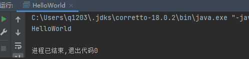
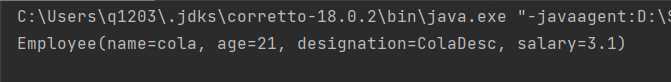
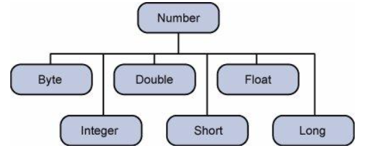

# Java 基础学习
#W3Cschool #Java 
> Author: Cola
>
> Time: 2022-10-5 18:56:37
>
> To: 凌云(长期维护项目) 😕

> 开发环境：
>
> - idea:  IDEA 2021.3.3
> - jdk:   18.0.2

> 随记：
>
> - 添加项目初始框架部分(详细) ❓
> - 添加软件介绍及配置部分(详细)+常见错误 ❓

> 目录结构：
>
> - 一、初识 Java
> - 二、Java 基础

## 一、初识 Java

> 目录结构：
>
> - 一、初识 Java
>   - 1.1 Java 概况
>   - 1.2 主要特性
>   - 1.3 Java开发工具
>   - 1.4 我的第一个 Java 程序

### 1.1 Java 概况

> Java是由Sun Microsystems公司于1995年5月推出的Java面向对象程序设计语言和Java平台的总称。由詹姆斯·高斯林(James Gosling)和同事们共同研发，并在1995年正式推出。
>
> Java分为三个体系：
>
> * JavaSE(J2SE)(Java2 Platform Standard Edition，java平台标准版)
> * JavaEE(J2EE)(Java 2 Platform,Enterprise Edition，java平台企业版)
> * JavaME(J2ME)(Java 2 Platform Micro Edition，java平台微型版)
>
> 2005年6月，JavaOne大会召开，SUN公司公开Java SE 6。**此时，Java的各种版本已经更名以取消其中的数字"2"：J2EE更名为Java EE, J2SE更名为Java SE，J2ME更名为Java ME。**
>
> 2009年，sun公司被oracle收购.
>
> 2018年，开源组织Eclipse基金会宣布将JavaEE(Enterprise Edition)被更名为JakartaEE(雅加达)。

### 1.2 主要特性


|           特性           |                             说明                             |
| :----------------------: | :----------------------------------------------------------: |
|     Java语言是简单的     | Java语言的语法与C语言和C++语言很接近，使得大多数程序员很容易学习和使用。另一方面，Java丢弃了C++中很少使用的、很难理解的、令人迷惑的那些特性，如操作符重载、多继承、自动的强制类型转换。<br />**特别地，Java语言不使用指针，而是引用。并提供了自动的内存回收管理机制，使得程序员不必为内存管理而担忧。** |
|   Java语言是面向对象的   | Java语言提供类、接口和继承等原语，为了简单起见，只支持类之间的单继承，但支持接口之间的多继承，并支持类与接口之间的实现机制（关键字为implements）。<br />Java语言全面支持动态绑定，而C++语言只对虚函数使用动态绑定。总之，Java语言是一个纯的面向对象程序设计语言。 |
|    Java语言是分布式的    | Java语言支持Internet应用的开发，在基本的Java应用编程接口中有一个网络应用编程接口（java net），它提供了用于网络应用编程的<br />类库，包括URL、URLConnection、Socket、ServerSocket等。Java的RMI（远程方法激活）机制也是开发分布式应用的重要手段。 |
|     Java语言是健壮的     | Java的强类型机制、异常处理、垃圾的自动收集等是Java程序健壮性的重要保证。对指针的丢弃是Java的明智选择。Java的安全检查机制使得Java更具健壮性。 |
|     Java语言是安全的     | Java通常被用在网络环境中，为此，Java提供了一个安全机制以防恶意代码的攻击。除了Java语言具有的许多安全特性以外，Java对通过<br />网络下载的类具有一个安全防范机制（类ClassLoader），如分配不同的名字空间以防替代本地的同名类、字节代码检查，并提  <br />供安全管理机制（类SecurityManager）让Java应用设置安全哨兵。 |
| Java语言是体系结构中立的 | Java程序（后缀为java的文件）在Java平台上被编译为体系结构中立的字节码格式（后缀为class的文件），然后可以在实现这个Java平台的任何系统中运行。这种途径适合于异构的网络环境和软件的分发。 |
|    Java语言是可移植的    | 这种可移植性来源于体系结构中立性，另外，Java还严格规定了各个基本数据类型的长度。Java系统本身也具有很强的可移植性，<br />Java编译器是用Java实现的，Java的运行环境是用ANSI C实现的。 |
|    Java语言是解释型的    | 如前所述，Java程序在Java平台上被编译为字节码格式，然后可以在实现这个Java平台的任何系统中运行。**在<br />运行时，Java平台中的Java解释器对这些字节码进行解释执行，执行过程中需要的类在联接阶段被载入到运行环境中。** |
|    Java语言是多线程的    | 在Java语言中，线程是一种特殊的对象，它必须由Thread类或其子（孙）类来创建。通常有两种方法来创建线程：<br />其一，使用型构为Thread(Runnable)的构造子将一个实现了Runnable接口的对象包装成一个线程， <br />其二，从Thread类派生出子类并重写run方法，使用该子类创建的对象即为线程。值得注意的是Thread类已经实现了Runnable接口，  <br />因此，任何一个线程均有它的run方法，而run方法中包含了线程所要运行的代码。线程的活动由一组方法来控制。Java语言支持多个线程的同时执行，并提供多线程之间的同步机制（关键字为synchronized）。 |
|     Java语言是动态的     | Java语言的设计目标之一是适应于动态变化的环境。Java程序需要的类能够动态地被载入到运行环境，<br />也可以通过网络来载入所需要的类。这也有利于软件的升级。另外，Java中的类有一个运行时刻的表示，能进行运行时刻的类型检查。 |

### 1.3 Java开发工具

> - JDK
>   - 全局JDK的安装和配置
>   - 局部JDK的安装
> - IDE
>   - Eclipse
>   - IntelliJ IDEA
>
> TODO 建立锚连接

### 1.4 我的第一个 Java 程序

- 向控制台输出 HelloWordl

```java
public class HelloWorld {
    public static void main(String[] args) {
        System.out.println("HelloWorld");
    }
}

```

- 输出结果：



> - 其中 HelloWorld 为类(class)的名称 类为 Java 程序中最小的组成单元
> - 类的命名规范建议采用  驼峰命名法且首字母大写 例如： ColaTest

- 常见问题:

> - 中文控制台乱码
>   > 原因默认的字符集编码和cmd的字符集编码格式不统一
>   >

## 二、Java 基础

> 目录结构：
>
> - 二、Java 基础
>   - 2.1 基础语法
>   - 2.2 Java 对象和类
>   - 2.3 Java 基本数据类型
>   - 2.4 Java 变量类型
>   - 2.5 Java 修饰符
>   - 2.6 Java 运算符
>   - 2.7 循环结构
>   - 2.8 分支结构
>   - 2.9 Number 类
>   - 2.10 Character 类
>   - 2.11 String 类
>   - 2.12 StringBuffer 和 StringBuild
>   - 2.13 数组
>   - 2.14 日期时间
>   - 2.15 正则表达式
>   - 2.16 方法
>   - 2.17 Stream 流、File 文件和IO
>   - 2.18 Scanner类
>   - 2.19 异常处理

### 2.1  基础语法

> 目录结构：
>
> - 2.1.1 Java标识符
> - 2.1.2 Java 修饰符
> - 2.1.3 Java 变量
> - 2.1.4 Java 数组
> - 2.1.5 Java 枚举
> - 2.1.6 Java 关键字
> - 2.1.7 Java 注释
> - 2.1.8 Java 空行
> - 2.1.9 继承
> - 2.1.10 接口

一个Java程序可以认为是一系列对象的集合，而这些对象通过调用彼此的方法来协同工作。下面简要介绍下类、对象、方法和实例变量的概念。

* **对象** ：对象是类的一个实例，有状态和行为。例如，一条狗是一个对象，它的状态有：颜色、名字、品种；行为有：摇尾巴、叫、吃等。
* **类** ：类是一个模板，它描述一类对象的行为和状态。
* **方法** ：方法就是行为，一个类可以有很多方法。逻辑运算、数据修改以及所有动作都是在方法中完成的。
* **实例变量** ：每个对象都有独特的实例变量，对象的状态由这些实例变量的值决定。

编写Java程序时，应注意以下几点：

* **大小写敏感** ：Java是大小写敏感的，这就意味着标识符Hello与hello是不同的。
* **类名** ：对于所有的类来说，类名的首字母应该大写。如果类名由若干单词组成，那么每个单词的首字母应该大写，例如 MyFirstJavaClass 。
* **方法名** ：所有的方法名都应该以小写字母开头。如果方法名含有若干单词，则后面的每个单词首字母大写。
* **源文件名** ：源文件名必须和类名相同。当保存文件的时候，你应该使用类名作为文件名保存（切记Java是大小写敏感的），文件名的后缀为.java。（如果文件名和类名不相同则会导致编译错误）。
* **主方法入口** ：所有的Java 程序由`public static void main(String[]args)`方法开始执行。

#### 2.1.1 Java标识符

Java所有的组成部分都需要名字。类名、变量名以及方法名都被称为标识符。

关于Java标识符，有以下几点需要注意：

* 所有的标识符都应该以字母（A-Z或者a-z）,美元符（$）、或者下划线（_）开始
* 首字符之后可以是字母（A-Z 或者 a-z）,美元符（$）、下划线（_）或数字的任何字符组合
* 关键字不能用作标识符
* 标识符是大小写敏感的
* 合法标识符举例：age、$salary、_value、__1_value
* 非法标识符举例：123abc、-salary

#### 2.1.2 Java修饰符

像其他语言一样，Java可以使用修饰符来修饰类中方法和属性。主要有两类修饰符：

像其他语言一样，Java可以使用修饰符来修饰类中方法和属性。主要有两类修饰符：

* 访问控制修饰符 : default, public , protected, private
* 非访问控制修饰符 : final, abstract, static，synchronized 和 volatile

在后面的章节中我们会深入讨论Java修饰符。

#### 2.1.3 Java变量

Java中主要有如下几种类型的变量

* 局部变量
* 类变量（静态变量）
* 成员变量（非静态变量）

#### 2.1.4 Java数组

数组是储存在堆上的对象，可以保存多个同类型变量。在后面的章节中，我们将会学到如何声明、构造以及初始化一个数组。

#### 2.1.5 Java枚举

Java 5.0引入了枚举，枚举限制变量只能是预先设定好的值。使用枚举可以减少代码中的 bug 。

例如，我们为果汁店设计一个程序，它将限制果汁为小杯、中杯、大杯。这就意味着它不允许顾客点除了这三种尺寸外的果汁。

```java
class FreshJuice {
   enum FreshJuiceSize{ SMALL, MEDIUM, LARGE }
   FreshJuiceSize size;
}

public class FreshJuiceTest {
   public static void main(String args[]){
      FreshJuice juice = new FreshJuice();
      juice.size = FreshJuice. FreshJuiceSize.MEDIUM ;
   }
}

```

**注意：** 枚举可以单独声明或者声明在类里面。方法、变量、构造函数也可以在枚举中定义。

#### 2.1.6 Java关键字

下面列出了Java保留字。这些保留字不能用于常量、变量、和任何标识符的名称。


| 关键字       | 描述                                                                                       |
| -------------- | -------------------------------------------------------------------------------------------- |
| abstract     | 抽象方法，抽象类的修饰符                                                                   |
| assert       | 断言条件是否满足                                                                           |
| boolean      | 布尔数据类型                                                                               |
| break        | 跳出循环或者label代码段                                                                    |
| byte         | 8-bit 有符号数据类型                                                                       |
| case         | switch语句的一个条件                                                                       |
| catch        | 和try搭配捕捉异常信息                                                                      |
| char         | 16-bit Unicode字符数据类型                                                                 |
| class        | 定义类                                                                                     |
| const        | 未使用                                                                                     |
| continue     | 不执行循环体剩余部分                                                                       |
| default      | switch语句中的默认分支                                                                     |
| do           | 循环语句，循环体至少会执行一次                                                             |
| double       | 64-bit双精度浮点数                                                                         |
| else         | if条件不成立时执行的分支                                                                   |
| enum         | 枚举类型                                                                                   |
| extends      | 表示一个类是另一个类的子类                                                                 |
| final        | 表示一个值在初始化之后就不能再改变了<br/>表示方法不能被重写，或者一个类不能有子类          |
| finally      | 为了完成执行的代码而设计的，主要是为了程序的健壮性和完整性，无论有没有异常发生都执行代码。 |
| float        | 32-bit单精度浮点数                                                                         |
| for          | for循环语句                                                                                |
| goto         | 未使用                                                                                     |
| if           | 条件语句                                                                                   |
| implements   | 表示一个类实现了接口                                                                       |
| import       | 导入类                                                                                     |
| instanceof   | 测试一个对象是否是某个类的实例                                                             |
| int          | 32位整型数                                                                                 |
| interface    | 接口，一种抽象的类型，仅有方法和常量的定义                                                 |
| long         | 64位整型数                                                                                 |
| native       | 表示方法用非java代码实现                                                                   |
| new          | 分配新的类实例                                                                             |
| package      | 一系列相关类组成一个包                                                                     |
| private      | 表示私有字段，或者方法等，只能从类内部访问                                                 |
| protected    | 表示字段只能通过类或者其子类访问<br/>子类或者在同一个包内的其他类                          |
| public       | 表示共有属性或者方法                                                                       |
| return       | 方法返回值                                                                                 |
| short        | 16位数字                                                                                   |
| static       | 表示在类级别定义，所有实例共享的                                                           |
| strictfp     | 浮点数比较使用严格的规则                                                                   |
| super        | 表示基类                                                                                   |
| switch       | 选择语句                                                                                   |
| synchronized | 表示同一时间只能由一个线程访问的代码块                                                     |
| this         | 表示调用当前实例<br/>或者调用另一个构造函数                                                |
| throw        | 抛出异常                                                                                   |
| throws       | 定义方法可能抛出的异常                                                                     |
| transient    | 修饰不要序列化的字段                                                                       |
| try          | 表示代码块要做异常处理或者和finally配合表示是否抛出异常都执行finally中的代码               |
| void         | 标记方法不返回任何值                                                                       |
| volatile     | 标记字段可能会被多个线程同时访问，而不做同步                                               |
| while        | while循环                                                                                  |

#### 2.1.7 Java注释

类似于C/C++，Java也支持单行以及多行注释。注释中的字符将被Java编译器忽略。

```java
public class MyFirstJavaProgram{
   /* 这是第一个Java程序
    *它将打印Hello World
    * 这是一个多行注释的示例
    */
    public static void main(String []args){
       // 这是单行注释的示例
       /* 这个也是单行注释的示例 */
       System.out.println("Hello World"); 
    }
} 

```

#### 2.1.8 Java 空行

空白行，或者只有注释的行，Java编译器都会忽略掉。

#### 2.1.9 继承

在Java中，一个类可以由其他类派生。如果你要创建一个类，而且已经存在一个类具有你所需要的属性或方法，那么你可以将新创建的类继承该类。

利用继承的方法，可以重用已存在类的方法和属性，而不用重写这些代码。被继承的类称为超类（super class），派生类称为子类（subclass）。

#### 2.1.10 接口

在Java中，接口可理解为对象间相互通信的协议。接口在继承中扮演着很重要的角色。

接口只定义派生要用到的方法，但是方法的具体实现完全取决于派生类。

下一节介绍Java编程中的类和对象。之后你将会对Java中的类和对象有更清楚的认识。

### 2.2 Java 对象和类

> 目录结构：
>
> - 2.2.1 Java中的对象
> - 2.2.2 Java 中的类
> - 2.2.3 构造方法
> - 2.2.4 创建对象
> - 2.2.5 访问实例变量和方法
> - 2.2.6 实例
> - 2.2.7 源文件声明规则
> - 2.2.8 Java 包
> - 2.2.9 import 语句
> - 2.2.10 一个简单的例子

在理解Java的类和对象之前，先简单介绍一下面向对象的程序设计。面向对象程序设计是通过对象对程序进行设计，对象代表一个实体，实体可以清楚地被识别。

Java作为一种面向对象语言。支持以下基本概念：

* 多态
* 继承
* 封装
* 抽象
* 类
* 对象
* 实例
* 方法
* 消息解析

本节我们重点研究对象和类的概念。

* **对象** ：对象是类的一个实例，有状态和行为。例如，一条狗是一个对象，它的状态有：颜色、名字、品种；行为有：摇尾巴、叫、吃等。
* **类** ：类是一个模板，它描述一类对象的行为和状态。

#### 2.2.1 Java中的对象

现在让我们深入了解什么是对象。看看周围真实的世界，会发现身边有很多对象，车，狗，人等等。所有这些对象都有自己的状态和行为。

拿一条狗来举例，它的状态有：名字、品种、颜色，行为有：叫、摇尾巴和跑。

对比现实对象和软件对象，它们之间十分相似。

软件对象也有状态和行为。软件对象的状态就是属性，行为通过方法体现。

在软件开发中，方法操作对象内部状态的改变，对象的相互调用也是通过方法来完成。

#### 2.2.2 Java 中的类

类可以看成是创建 Java 对象的模板。

通过下面一个简单的类来理解下 Java 中类的定义：

```java
public class Dog {
    // 属性
    String breed;
    Integer age;
    String color;

    // 方法
    void barking(){
    }

    void hungry(){
    }

    void sleeping(){
    }
}
```

* **局部变量** ：在方法、构造方法或者语句块中定义的变量被称为局部变量。变量声明和初始化都是在方法中，方法结束后，变量就会自动销毁。
* **成员变量** ：成员变量是定义在类中，方法体之外的变量。这种变量在创建对象的时候实例化。成员变量可以被类中方法、构造方法和特定类的语句块访问。
* **类变量** ：类变量也声明在类中，方法体之外，但必须声明为 static 类型。

一个类可以拥有多个方法，在上面的例子中：`barking()`、`hungry()`和 `sleeping()`都是 Dog 类的方法。

#### 2.2.3 构造方法

每个类都有构造方法。如果没有显式地为类定义构造方法，Java编译器将会为该类提供一个默认构造方法。

在创建一个对象的时候，至少要调用一个构造方法。构造方法的名称必须与类同名，一个类可以有多个构造方法。

下面是一个构造方法示例：

```java
    public Dog() {
    }

    public Dog(String breed, Integer age, String color) {
        this.breed = breed;
        this.age = age;
        this.color = color;
    }
```

#### 2.2.4 创建对象

对象是根据类创建的。在 Java 中，使用关键字 `new` 来创建一个新的对象。创建对象需要以下三步：

* **声明** ：声明一个对象，包括对象名称和对象类型。
* **实例化** ：使用关键字 `new` 来创建一个对象。
* **初始化** ：使用 `new` 创建对象时，会调用构造方法初始化对象。

#### 2.2.5 访问实例变量和方法

通过已创建的对象来访问成员变量和成员方法

#### 2.2.6 实例

下面的例子展示如何访问实例变量和调用成员方法：

```java
    public static void main(String[] args) {
        Dog dog = new Dog("HaShiQi",5,"black");

        System.out.println(dog.breed + "age is" + dog.age);

    }
```

#### 2.2.7 源文件声明规则

在本节的最后部分，我们将学习源文件的声明规则。当在一个源文件中定义多个类，并且还有`import`语句和`package` 语句时，要特别注意这些规则。

* 一个源文件中只能有一个 `public` 类
* 一个源文件可以有多个非`public`类
* 源文件的名称应该和`public`类的类名保持一致。例如：源文件中`public`类的类名是`Employee`，那么源文件应该命名为`Employee.java`。
* 如果一个类定义在某个包中，那么`package`语句应该在源文件的首行。
* 如果源文件包含`import`语句，那么应该放在`package`语句和类定义之间。如果没有`package`语句，那么`import`语句应该在源文件中最前面。
* `import`语句和`package`语句对源文件中定义的所有类都有效。在同一源文件中，不能给不同的类不同的包声明。

类有若干种访问级别，并且类也分不同的类型：抽象类和`final`类等。这些将在访问控制章节介绍。

除了上面提到的几种类型，Java 还有一些特殊的类，如：内部类、匿名类。

#### 2.2.8 Java 包

包主要用来对类和接口进行分类。当开发 Java 程序时，可能编写成百上千的类，因此很有必要对类和接口进行分类。

#### 2.2.9 import 语句

在 Java 中，如果给出一个完整的限定名，包括包名、类名，那么 Java 编译器就可以很容易地定位到源代码或者类。`Import` 语句就是用来提供一个合理的路径，使得编译器可以找到某个类。

例如，下面的命令行将会命令编译器载入 java_installation/java/io 路径下的所有类

```java
import java.io.*;
```

#### 2.2.10 一个简单的例子

在该例子中，我们创建两个类：Employee 和 EmployeeTest。

首先打开文本编辑器，把下面的代码粘贴进去。注意将文件保存为 Employee.java。

Employee 类有四个成员变量：name、age、designation 和 salary。该类显式声明了一个构造方法，该方法只有一个参数。

```java
package Day01;

import lombok.AllArgsConstructor;
import lombok.Data;
import lombok.NoArgsConstructor;

/**
 * @ Name: Employee
 * @ Author: Cola
 * @ Time: 2022/10/7 9:16
 * @ Description: TODO
 */
@Data
@AllArgsConstructor
@NoArgsConstructor
public class Employee {
    String name;
    Integer age;
    String designation;
    Double salary;
}
```

程序都是从 `main`方法开始执行。为了能运行这个程序，必须包含 `main` 方法并且创建一个实例对象。

```java
package Day01;

/**
 * @ Name: EmployeeTest
 * @ Author: Cola
 * @ Time: 2022/10/7 9:23
 * @ Description: TODO
 */
public class EmployeeTest {
    public static void main(String[] args) {
        Employee employee = new Employee("cola",21,"ColaDesc",Double.valueOf(3.1));
        System.out.println(employee.toString());
    }
}

```



### 2.3 Java 基本数据类型

> 目录结构：
>
> - 2.3.1 内置数据类型
> - 2.3.2 引用类型
> - 2.3.3 Java 常量

变量就是申请内存来存储值。也就是说，当创建变量的时候，需要在内存中申请空间。

内存管理系统根据变量的类型为变量分配存储空间，分配的空间只能用来储存该类型数据。

因此，通过定义不同类型的变量，可以在内存中储存整数、小数或者字符。

Java的两大数据类型：

* 内置数据类型
* 引用数据类型

#### 2.3.1 内置数据类型

Java语言提供了八种基本类型。六种数字类型（四个整数型，两个浮点型），一种字符类型，还有一种布尔型。

byte型：

* byte数据类型是8位、有符号的，以二进制补码表示的整数；
* 最小值是-128（-2^7）；
* 最大值是127（2^7-1）；
* 默认值是0；
* byte类型用在大型数组中节约空间，主要代替整数，因为byte变量占用的空间只有int类型的四分之一；
* 例子：byte a = 100，byte b = -50。

short型（短整型）：

* short数据类型是16位、有符号的以二进制补码表示的整数
* 最小值是-32768（-2^15）；
* 最大值是32767（2^15 - 1）；
* Short数据类型也可以像byte那样节省空间。一个short变量是int型变量所占空间的二分之一；
* 默认值是0；
* 例子：short s = 1000，short r = -20000。

int型（整型）：

* int数据类型是32位、有符号的以二进制补码表示的整数；
* 最小值是-2,147,483,648（-2^31）；
* 最大值是2,147,483,647（2^31 - 1）；
* 一般地整型变量默认为int类型；
* 默认值是0；
* 例子：int a = 100000, int b = -200000。

long（长整型）：

* long数据类型是64位、有符号的以二进制补码表示的整数；
* 最小值是-9,223,372,036,854,775,808（-2^63）；
* 最大值是9,223,372,036,854,775,807（2^63 -1）；
* 这种类型主要使用在需要比较大整数的系统上；
* 默认值是0L；
* 例子： long a = 100000L，long b = -200000L。

float（单精度浮点型）：

* float数据类型是单精度、32位、符合IEEE 754标准的浮点数；
* float在储存大型浮点数组的时候可节省内存空间；
* 默认值是0.0f；
* 浮点数不能用来表示精确的值，如货币；
* 例子：float f1 = 234.5f。

double（双精度浮点型）：

* double数据类型是双精度、64位、符合IEEE 754标准的浮点数；
* 浮点数的默认类型为double类型；
* double类型同样不能表示精确的值，如货币；
* 默认值是0.0d；
* 例子：double d1 = 123.4。

boolean（布尔型）：

* boolean数据类型表示一位的信息；
* 只有两个取值：true和false；
* 这种类型只作为一种标志来记录true/false情况；
* 默认值是false；
* 例子：boolean one = true。

char（字符型）：

* char类型是一个单一的16位Unicode字符；
* 最小值是’\u0000’（即为0）；
* 最大值是’\uffff’（即为65,535）；
* char数据类型可以储存任何字符；
* 例子：char letter = ‘A’。

> 对于数值类型的基本类型的取值范围，我们无需强制去记忆，因为它们的值都已经以常量的形式定义在对应的包装类中了。请看下面的例子：

```java
package Day02;

/**
 * @ Name: PrimitiveTypeTest
 * @ Author: Cola
 * @ Time: 2022/10/7 13:24
 * @ Description: Java 中基本类型的取值范围可以通过常量的方式表示
 */
public class PrimitiveTypeTest {
    public static void main(String[] args) {
        // byte
        System.out.println("基本类型： byte 二进制位数为 " + Byte.SIZE);
        System.out.println("包装类为: java.lang.Byte");
        System.out.println("最小值Byte.MIN_VALUE= " + Byte.MIN_VALUE);
        System.out.println("最大值Byte.MAX_VALUE= " + Byte.MAX_VALUE);
        System.out.println("-------------------");

        // short
        System.out.println("基本类型： short 二进制位数为 " + Short.SIZE);
        System.out.println("包装类为: java.lang.Short");
        System.out.println("最小值Short.MIN_VALUE= " + Short.MIN_VALUE);
        System.out.println("最大值Short.MAX_VALUE= " + Short.MAX_VALUE);
        System.out.println("-------------------");

        // int
        System.out.println("基本类型： int 二进制位数为 " + Integer.SIZE);
        System.out.println("包装类为: java.lang.Integer");
        System.out.println("最小值Integer.MIN_VALUE= " + Integer.MIN_VALUE);
        System.out.println("最大值Integer.MAX_VALUE= " + Integer.MAX_VALUE);
        System.out.println("-------------------");

        // long
        System.out.println("基本类型： long 二进制位数为 " + Long.SIZE);
        System.out.println("包装类为: java.lang.Long");
        System.out.println("最小值Long.MIN_VALUE= " + Long.MIN_VALUE);
        System.out.println("最大值Long.MAX_VALUE= " + Long.MAX_VALUE);
        System.out.println("-------------------");

        // float
        System.out.println("基本类型： float 二进制位数为 " + Float.SIZE);
        System.out.println("包装类为: java.lang.Float");
        System.out.println("最小值Float.MIN_VALUE= " + Float.MIN_VALUE);
        System.out.println("最大值Float.MAX_VALUE= " + Float.MAX_VALUE);
        System.out.println("-------------------");

        // double
        System.out.println("基本类型： double 二进制位数为 " + Double.SIZE);
        System.out.println("包装类为: java.lang.Double");
        System.out.println("最小值Double.MIN_VALUE= " + Double.MIN_VALUE);
        System.out.println("最大值Double.MAX_VALUE= " + Double.MAX_VALUE);
        System.out.println("-------------------");

        // char
        System.out.println("基本类型： char 二进制位数为 " + Character.SIZE);
        System.out.println("包装类为: java.lang.Character");
        // 以数值形式而不是字符形式输出到控制台
        System.out.println("最小值Character.MIN_VALUE= " + (int) Character.MIN_VALUE);
        System.out.println("最大值Character.MAX_VALUE= " + (int) Character.MAX_VALUE);
        System.out.println("-------------------");
    }
}

```

```java
基本类型：byte 二进制位数：8
包装类：java.lang.Byte
最小值：Byte.MIN_VALUE=-128
最大值：Byte.MAX_VALUE=127
基本类型：short 二进制位数：16
包装类：java.lang.Short
最小值：Short.MIN_VALUE=-32768
最大值：Short.MAX_VALUE=32767


基本类型：int 二进制位数：32
包装类：java.lang.Integer
最小值：Integer.MIN_VALUE=-2147483648
最大值：Integer.MAX_VALUE=2147483647


基本类型：long 二进制位数：64
包装类：java.lang.Long
最小值：Long.MIN_VALUE=-9223372036854775808
最大值：Long.MAX_VALUE=9223372036854775807


基本类型：float 二进制位数：32
包装类：java.lang.Float
最小值：Float.MIN_VALUE=1.4E-45
最大值：Float.MAX_VALUE=3.4028235E38


基本类型：double 二进制位数：64
包装类：java.lang.Double
最小值：Double.MIN_VALUE=4.9E-324
最大值：Double.MAX_VALUE=1.7976931348623157E308


基本类型：char 二进制位数：16
包装类：java.lang.Character
最小值：Character.MIN_VALUE=0
最大值：Character.MAX_VALUE=65535
```

Float和Double的最小值和最大值都是以科学记数法的形式输出的，结尾的"E+数字"表示E之前的数字要乘以10的“数字”次幂。比如3.14E3就是3.14×1000=3140，3.14E-3就是3.14/1000=0.00314。

实际上，JAVA中还存在另外一种基本类型void，它也有对应的包装类 java.lang.Void，不过我们无法直接对它们进行操作。

```java
        // void
        System.out.println(Void.TYPE);
```

#### 2.3.2 引用类型

* 引用类型变量由类的构造函数创建，可以使用它们访问所引用的对象。这些变量在声明时被指定为一个特定的类型，比如Employee、Pubby等。变量一旦声明后，类型就不能被改变了。
* 对象、数组都是引用数据类型。
* 所有引用类型的默认值都是null。
* 一个引用变量可以用来引用与任何与之兼容的类型。
* 例子：Animal animal = new Animal(“giraffe”)。

#### 2.3.3 Java 常量

常量就是一个固定值。它们不需要计算，直接代表相应的值。

常量指不能改变的量。 在Java中用final标志，声明方式和变量类似：

```java
final double PI = 3.1415927;

```

虽然常量名也可以用小写，但为了便于识别，通常使用大写字母表示常量。

字面量可以赋给任何内置类型的变量。例如：

```java
byte a = 68;
char a = 'A'

```

byte、int、long、和short都可以用十进制、16进制以及8进制的方式来表示。

当使用常量的时候，前缀0表明是8进制，而前缀0x代表16进制。例如：

```java
int decimal = 100;
int octal = 0144;
int hexa =  0x64;

```

和其他语言一样，Java的字符串常量也是包含在两个引号之间的字符序列。下面是字符串型字面量的例子：

```java
"Hello World"
"two\nlines"
"\"This is in quotes\""

```

字符串常量和字符常量都可以包含任何Unicode字符。例如：

```java
char a = '\u0001';
String a = "\u0001";

```

Java语言支持一些特殊的转义字符序列。


| 符号   | 字符含义                 |
| -------- | -------------------------- |
| \n     | 换行 (0x0a)              |
| \r     | 回车 (0x0d)              |
| \f     | 换页符(0x0c)             |
| \b     | 退格 (0x08)              |
| \0     | 空字符（0x0）            |
| \s     | 字符串<br/>              |
| \t     | 制表符                   |
| \"     | 双引号                   |
| \'     | 单引号                   |
| \\     | 反斜杠                   |
| \ddd   | 八进制字符 (ddd)         |
| \uxxxx | 16进制Unicode字符 (xxxx) |

这一节讲解了Java的基本数据类型。下一节将探讨不同的变量类型以及它们的用法。

### 2.4 Java 变量类型

> 目录结构：
>
> - 2.4.1 Java 局部变量
> - 2.4.2 实例变量
> - 2.4.3 类变量（静态变量）

在 Java 语言中，所有的变量在使用前必须声明。声明变量的基本格式如下：

```java
type identifier [ = value][, identifier [= value] ...] ;

```

格式说明：type 为 Java 数据类型。identifier 是变量名。可以使用逗号隔开来声明多个同类型变量。

以下列出了一些变量的声明实例。注意有些包含了初始化过程。

```java
int a, b, c;         // 声明三个int型整数：a、b、c。
int d = 3, e, f = 5; // 声明三个整数并赋予初值。
byte z = 22;         // 声明并初始化z。
double pi = 3.14159; // 声明了pi。
char x = 'x';        // 变量x的值是字符'x'。

```

Java 语言支持的变量类型有：

* 局部变量：类的方法中的变量。
* 实例变量：独立于方法之外的变量，不过没有 static 修饰。
* 类变量：独立于方法之外的变量，用 static 修饰。

```java
public class Variable{
    static int allClicks=0;    // 类变量

    String str="hello world";  // 实例变量
 
    public void method(){
        int i =0;  // 局部变量
    }
}
```

#### 2.4.1 Java 局部变量

* 局部变量声明在方法、构造方法或者语句块中；
* 局部变量在方法、构造方法、或者语句块被执行的时候创建，当它们执行完成后，变量将会被销毁；
* 访问修饰符不能用于局部变量；
* 局部变量只在声明它的方法、构造方法或者语句块中可见；
* 局部变量是在栈上分配的。
* 局部变量没有默认值，所以局部变量被声明后，必须经过初始化，才可以使用。

在以下实例中 age 是一个局部变量。定义在 pupAge() 方法中，它的作用域就限制在这个方法中。

```java
public class Test{ 
   public void pupAge(){
      int age = 0;
      age = age + 7;
      System.out.println("Puppy age is : " + age);
   }
   
   public static void main(String args[]){
      Test test = new Test();
      test.pupAge();
   }
}

```

以上实例编译运行结果如下：

```java
Puppy age is: 7

```

在下面的例子中 age 变量没有初始化，所以在编译时出错。

```java
public class Test{ 
   public void pupAge(){
      int age;
      age = age + 7;
      System.out.println("Puppy age is : " + age);
   }
   
   public static void main(String args[]){
      Test test = new Test();
      test.pupAge();
   }
}

```

以上实例编译运行结果如下:

```java
Test.java:4:variable number might not have been initialized
age = age + 7;
         ^
1 error

```

#### 2.4.2 实例变量

* 实例变量声明在一个类中，但在方法、构造方法和语句块之外；
* 当一个对象被实例化之后，每个实例变量的值就跟着确定；
* 实例变量在对象创建的时候创建，在对象被销毁的时候销毁；
* 实例变量的值应该至少被一个方法、构造方法或者语句块引用，使得外部能够通过这些方式获取实例变量信息；
* 实例变量可以声明在使用前或者使用后；
* 访问修饰符可以修饰实例变量；
* 实例变量对于类中的方法、构造方法或者语句块是可见的。一般情况下应该把实例变量设为私有。通过使用访问修饰符可以使实例变量对子类可见；
* 实例变量具有默认值。数值型变量的默认值是0，布尔型变量的默认值是 false，引用类型变量的默认值是 null。变量的值可以在声明时指定，也可以在构造方法中指定；
* 实例变量可以直接通过变量名访问。但在静态方法以及其他类中，就应该使用完全限定名：ObejectReference.VariableName。

```java
package Day02;

import lombok.AllArgsConstructor;
import lombok.Data;
import lombok.NoArgsConstructor;

/**
 * @ Name: IdentifierTest
 * @ Author: Cola
 * @ Time: 2022/10/7 13:47
 * @ Description: 局部变量为 代码块，方法内的变量 因为定义在栈内存中所以使用前必须先赋值
 */
@Data
@AllArgsConstructor
@NoArgsConstructor
public class IdentifierTest {
    // 实例变量
    // 这个成员变量对子类可见
    public String name;
    // 私有变量，仅在该类可见
    private double salary;

    public static void main(String[] args) {


        // 实例变量
        IdentifierTest identifierTest1 = new IdentifierTest("Cola", 3.14);
        // 访问实例变量
        System.out.println(identifierTest1.name);
        System.out.println(identifierTest.salary);
        // 修改
        identifierTest1.setName("XiaoEr");

    }
}

```

#### 2.4.3 类变量（静态变量）

* 类变量也称为静态变量，在类中以 static 关键字声明，但必须在方法、构造方法和语句块之外。
* 无论一个类创建了多少个对象，类只拥有类变量的一份拷贝。
* 静态变量除了被声明为常量外很少使用。常量是指声明为 public/private，final 和 static 类型的变量。常量初始化后不可改变。
* 静态变量储存在静态存储区。经常被声明为常量，很少单独使用 static 声明变量。
* 静态变量在程序开始时创建，在程序结束时销毁。
* 与实例变量具有相似的可见性。但为了对类的使用者可见，大多数静态变量声明为 public 类型。
* 默认值和实例变量相似。数值型变量默认值是0，布尔型默认值是 false，引用类型默认值是 null。变量的值可以在声明的时候指定，也可以在构造方法中指定。此外，静态变量还可以在静态语句块中初始化。
* 静态变量可以通过：ClassName.VariableName 的方式访问。
* 类变量被声明为 public static final 类型时，类变量名称必须使用大写字母。如果静态变量不是 public 和 final 类型，其命名方式与实例变量以及局部变量的命名方式一致。

```java
import java.io.*;
public class Employee{
   //description是静态的私有变量
   private static double description;
   // DEPARTMENT是一个常量
   public static final String DEPARTMENT = "Development ";
   public static void main(String args[]){

        System.out.println(IdentifierTest.DEPARTMENT);
        System.out.println(IdentifierTest.description);
   }
}

```

### 2.5 Java 修饰符

> 目录结构：
>
> - 2.5.1 访问控制修饰符
> - 2.5.2 默认访问修饰符（不使用任关键字）
> - 2.5.3 私有访问修饰符 private
> - 2.5.4 公有访问修饰符 public
> - 2.5.5 受保护的访问修饰符 protected
> - 2.5.6 访问控制和继承
> - 2.5.7 非访问修饰符
> - 2.5.8 static 修饰符
> - 2.5.9 final 修饰符
> - 2.5.10 abstract 修饰符
> - 2.5.11 抽象方法
> - 2.5.12 syncharonized 修饰符
> - 2.5.13 transient 修饰符
> - 2.5.14 volatile 修饰符

Java 语言提供了很多修饰符，主要分为以下两类：

* 访问修饰符
* 非访问修饰符

修饰符用来定义类、方法或者变量，通常放在语句的最前端。我们通过下面的例子来说明：

```java
public class className {
   // ...
}
private boolean myFlag;
static final double weeks = 9.5;
protected static final int BOXWIDTH = 42;
public static void main(String[] arguments) {
   // 方法体
}

```

#### 2.5.1 访问控制修饰符

Java 中，可以使用访问控制符来保护对类、变量、方法和构造方法的访问。Java 支持4种不同的访问权限。

- 默认的，也称为 default，在同一包内可见，不使用任何修饰符。
- 私有的，以 private 修饰符指定，在同一类内可见。
- 公有的，以 public 修饰符指定，对所有类可见。
- 受保护的，以 protected 修饰符指定，对同一包内的类和所有子类可见。

#### 2.5.2 默认访问修饰符（不使用任关键字）

使用默认访问修饰符声明的变量和方法，对同一个包内的类是可见的。接口里的变量都隐式声明为`public static final`,而接口里的方法默认情况下访问权限为 `public`。

实例：

如下例所示，变量和方法的声明可以不使用任何修饰符。

```java
String version = "1.5.1";
boolean processOrder() {
   return true;
}

```

#### 2.5.3 私有访问修饰符 private

私有访问修饰符是最严格的访问级别，所以被声明为 private 的方法、变量和构造方法只能被所属类访问，并且类和接口不能声明为 private。

声明为私有访问类型的变量只能通过类中公共的 getter 方法被外部类访问。

Private 访问修饰符的使用主要用来隐藏类的实现细节和保护类的数据。

下面的类使用了私有访问修饰符：

```java
public class Logger {
   private String format;
   public String getFormat() {
      return this.format;
   }
   public void setFormat(String format) {
      this.format = format;
   }
}

```

实例中，Logger 类中的 format 变量为私有变量，所以其他类不能直接得到和设置该变量的值。为了使其他类能够操作该变量，定义了两个`public`方法：`getFormat()<span> </span>`（返回format的值）和`setFormat(String)`（设置format的值）

#### 2.5.4 公有访问修饰符 public

被声明为 public 的类、方法、构造方法和接口能够被任何其他类访问。

如果几个相互访问的 public 类分布在不同的包中，则需要导入相应 public 类所在的包。由于类的继承性，类所有的公有方法和变量都能被其子类继承。

以下函数使用了公有访问控制：

```java
public static void main(String[] arguments) {
   // ...
}

```

#### 2.5.5 受保护的访问修饰符 protected

被声明为 protected 的变量、方法和构造器能被同一个包中的任何其他类访问，也能够被不同包中的子类访问。

Protected 访问修饰符不能修饰类和接口，方法和成员变量能够声明为 protected，但是接口的成员变量和成员方法不能声明为 protected。

子类能访问 Protected 修饰符声明的方法和变量，这样就能保护不相关的类使用这些方法和变量。

下面的父类使用了 protected 访问修饰符，子类重载了父类的 openSpeaker() 方法。

```java
class AudioPlayer {
   protected boolean openSpeaker(Speaker sp) {
      // 实现细节
   }
}

class StreamingAudioPlayer {
   boolean openSpeaker(Speaker sp) {
      // 实现细节
   }
}

```

如果把 openSpeaker() 方法声明为private，那么除了 AudioPlayer 之外的类将不能访问该方法。

如果把 openSpeaker() 声明为 public，那么所有的类都能够访问该方法。

如果我们只想让该方法对其所在类的子类可见，则将该方法声明为 protected。

#### 2.5.6 访问控制和继承

请注意以下方法继承的规则：

* 父类中声明为 public 的方法在子类中也必须为 public。
* 父类中声明为 protected 的方法在子类中要么声明为 protected，要么声明为 public。不能声明为 private。
* 父类中声明为 private 的方法，不能够被继承。

#### 2.5.7 非访问修饰符

为了实现一些其他的功能，Java 也提供了许多非访问修饰符。

static 修饰符，用来创建类方法和类变量。

final 修饰符，用来修饰类、方法和变量，final 修饰的类不能够被继承，修饰的方法不能被继承类重新定义，修饰的变量为常量，是不可修改的。

abstract 修饰符，用来创建抽象类和抽象方法。

synchronized 和 volatile 修饰符，主要用于线程的编程。

#### 2.5.8 static 修饰符

* **静态变量：**
  static 关键字用来声明独立于对象的静态变量，无论一个类实例化多少对象，它的静态变量只有一份拷贝。静态变量也被称为类变量。局部变量不能被声明为static变量。
* **静态方法：**
  static 关键字用来声明独立于对象的静态方法。静态方法不能使用类的非静态变量。静态方法从参数列表得到数据，然后计算这些数据。

对类变量和方法的访问可以直接使用 `classname.variablename` 和 `classname.methodname` 的方式访问。

如下例所示，static 修饰符用来创建类方法和类变量。

```java
public class InstanceCounter {
   private static int numInstances = 0;
   protected static int getCount() {
      return numInstances;
   }

   private static void addInstance() {
      numInstances++;
   }

   InstanceCounter() {
      InstanceCounter.addInstance();
   }

   public static void main(String[] arguments) {
      System.out.println("Starting with " +
      InstanceCounter.getCount() + " instances");
      for (int i = 0; i < 500; ++i){
          new InstanceCounter();
      }
      System.out.println("Created " +
       InstanceCounter.getCount() + " instances");
   }
} 
```

以上实例运行编辑结果如下:

```java
Started with 0 instances
Created 500 instances

```

#### 2.5.9 final 修饰符

- **final 变量：**

final 变量能被显式地初始化并且只能初始化一次。被声明为final的对象的引用不能指向不同的对象。但是 final 对象里的数据可以被改变。也就是说 final 对象的引用不能改变，但是里面的值可以改变。

final 修饰符通常和 static 修饰符一起使用来创建类常量。

实例:

```java
public class Test{
  final int value = 10;
  // 下面是声明常量的实例
  public static final int BOXWIDTH = 6;
  static final String TITLE = "Manager";

  public void changeValue(){
     value = 12; //将输出一个错误
  }
}
```

- **final 方法**

类中的 Final 方法可以被子类继承，但是不能被子类修改。

声明 final 方法的主要目的是防止该方法的内容被修改。

如下所示，使用 final 修饰符声明方法。

```java
public class Test{
    public final void changeName(){
       // 方法体
    }
}

```

- **final 类**

final 类不能被继承，没有类能够继承 final 类的任何特性。

实例：

```java
public final class Test {
   // 类体
}

```

#### 2.5.10 abstract 修饰符

- **抽象类：**

抽象类不能用来实例化对象，声明抽象类的唯一目的是为了将来对该类进行扩充。

一个类不能同时被 abstract 和 final 修饰。如果一个类包含抽象方法，那么该类一定要声明为抽象类，否则将出现编译错误。

抽象类可以包含抽象方法和非抽象方法。

实例：

```java
abstract class Caravan{
   private double price;
   private String model;
   private String year;
   public abstract void goFast(); //抽象方法
   public abstract void changeColor();
}

```

#### 2.5.11 抽象方法

抽象方法是一种没有任何实现的方法，该方法的的具体实现由子类提供。抽象方法不能被声明成 final 和 static。

任何继承抽象类的子类必须实现父类的所有抽象方法，除非该子类也是抽象类。

如果一个类包含若干个抽象方法，那么该类必须声明为抽象类。抽象类可以不包含抽象方法。

抽象方法的声明以分号结尾，例如：public abstract sample();

实例：

```java
public abstract class SuperClass{
    abstract void m(); //抽象方法
}
 
class SubClass extends SuperClass{
     //实现抽象方法
      void m(){
          .........
      }
}
```

#### 2.5.12 syncharonized 修饰符

synchronized 关键字声明的方法同一时间只能被一个线程访问。Synchronized 修饰符可以应用于四个访问修饰符。

实例：

```java
public synchronized void showDetails(){
.......
} 

```

#### 2.5.13 transient 修饰符

序列化的对象包含被 transient 修饰的实例变量时，java 虚拟机 (JVM) 跳过该特定的变量。

该修饰符包含在定义变量的语句中，用来预处理类和变量的数据类型。

实例：

```java
public transient int limit = 55;   // will not persist
public int b; // will persist

```

#### 2.5.14 volatile 修饰符

volatile 修饰的成员变量在每次被线程访问时，都强迫从共享内存中重读该成员变量的值。而且，当成员变量发生变化时，强迫线程将变化值回写到共享内存。这样在任何时刻，两个不同的线程总是看到某个成员变量的同一个值。

一个 volatile 对象引用可能是 null。

实例：

```java
public class MyRunnable implements Runnable
{
    private volatile boolean active;
    public void run()
    {
        active = true;
        while (active) // line 1
        {
            // 代码
        }
    }
    public void stop()
    {
        active = false; // line 2
    }
}

```

一般地，在一个线程中调用run()方法，在另一个线程中调用stop()方法。如果line 1中的active位于缓冲区的值被使用，那么当把line 2中的active设置成false时，循环也不会停止。

### 2.6 Java 运算符

> 目录结构：
>
> - 2.6.1 算术运算符
> - 2.6.2 关系运算符
> - 2.6.3 位运算符
> - 2.6.4 逻辑运算符
> - 2.6.5 赋值运算符
> - 2.6.6 条件运算符
> - 2.6.7 instanceof 运算符
> - 2.6.8 Java 运算符的优先级

计算机的最基本用途之一就是执行数学运算，作为一门计算机语言，Java也提供了一套丰富的运算符来操纵变量。我们可以把运算符分成以下几组：

* 算术运算符
* 关系运算符
* 位运算符
* 逻辑运算符
* 赋值运算符
* 其他运算符

#### 2.6.1 算术运算符

算术运算符用在数学表达式中，它们的作用和在数学中的作用一样。下表列出了所有的算术运算符。

表格中的实例假设整数变量A的值为10，变量B的值为20：


| 操作符 | 描述                              | 例子               |
| -------- | ----------------------------------- | -------------------- |
| +      | 加法 - 相加运算符两侧的值         | A + B等于30        |
| -      | 减法 - 左操作数减去右操作数       | A – B等于-10      |
| *      | 乘法 - 相乘操作符两侧的值         | A * B等于200       |
| /      | 除法 - 左操作数除以右操作数       | B / A等于2         |
| ％     | 取模 - 左操作数除以右操作数的余数 | B%A等于0           |
| ++     | 自增 - 操作数的值增加1            | B++ 或 ++B 等于 21 |
| --     | 自减 - 操作数的值减少1            | B-- 或 --B 等于 19 |

> 虽然都是自增（他们的运算结果都是等于B+1），但B++和++B还是有所区别，++B是左值，直接原地操作（可以理解为直接在变量B上+1），B++是右值，在编译器中运算的时候会先构建一个临时变量，用临时变量运算+1后再赋值给B。
>
> 所以，在下面实例代码中，打印d++的时候发现结果并没有+1（这个时候打印的是d这个变量，运算的是d的临时变量），但是后一条打印的语句显示的结果又是+1后的结果（临时变量的值赋给变量d了）。而打印++d的结果是直接+1的。

下面的简单示例程序演示了算术运算符。复制并粘贴下面的Java程序并保存为Test.java文件，然后编译并运行这个程序：

```java
public class Test {

  public static void main(String args[]) {
     int a = 10;
     int b = 20;
     int c = 25;
     int d = 25;
     System.out.println("a + b = " + (a + b) );
     System.out.println("a - b = " + (a - b) );
     System.out.println("a * b = " + (a * b) );
     System.out.println("b / a = " + (b / a) );
     System.out.println("b % a = " + (b % a) );
     System.out.println("c % a = " + (c % a) );
     System.out.println("a++   = " +  (a++) );
     System.out.println("a--   = " +  (a--) );
     // 查看  d++ 与 ++d 的不同
     System.out.println("d++   = " +  (d++) );
     System.out.println("d     = " +  d);
     System.out.println("++d   = " +  (++d) );
  }
} 

```

以上实例编译运行结果如下：

```java
a + b = 30
a - b = -10
a * b = 200
b / a = 2
b % a = 0
c % a = 5
a++   = 10
a--   = 11
d++   = 25
d     =26
++d   = 27

```

#### 2.6.2 关系运算符

下表为Java支持的关系运算符

表格中的实例整数变量A的值为10，变量B的值为20：


| 运算符 | 描述                                                             | 例子                   |
| -------- | ------------------------------------------------------------------ | ------------------------ |
| ==     | 检查如果两个操作数的值是否相等，如果相等则条件为真。             | （A == B）为假(非真)。 |
| !=     | 检查如果两个操作数的值是否相等，如果值不相等则条件为真。         | (A != B) 为真。        |
| >      | 检查左操作数的值是否大于右操作数的值，如果是那么条件为真。       | （A> B）非真。         |
| <      | 检查左操作数的值是否小于右操作数的值，如果是那么条件为真。       | （A <B）为真。         |
| >=     | 检查左操作数的值是否大于或等于右操作数的值，如果是那么条件为真。 | （A> = B）为假。       |
| <=     | 检查左操作数的值是否小于或等于右操作数的值，如果是那么条件为真。 | （A <= B）为真。       |

下面的简单示例程序演示了关系运算符。复制并粘贴下面的Java程序并保存为Test.java文件，然后编译并运行这个程序：

```java
public class Test {

  public static void main(String args[]) {
     int a = 10;
     int b = 20;
     System.out.println("a == b = " + (a == b) );
     System.out.println("a != b = " + (a != b) );
     System.out.println("a > b = " + (a > b) );
     System.out.println("a < b = " + (a < b) );
     System.out.println("b >= a = " + (b >= a) );
     System.out.println("b <= a = " + (b <= a) );
   } 
}  
```

以上实例编译运行结果如下：

```java
a == b = false
a != b = true
a > b = false
a < b = true b >= a = true
b <= a = false 
```

#### 2.6.3 位运算符

Java定义了位运算符，应用于整数类型(int)，长整型(long)，短整型(short)，字符型(char)，和字节型(byte)等类型。

位运算符作用在所有的位上，并且按位运算。假设a = 60，和b = 13;它们的二进制格式表示将如下：

下表列出了位运算符的基本运算,假设整数变量A的值为60和变量B的值为13：


| 操作符 | 描述                                                                               | 例子                                                               |
| -------- | ------------------------------------------------------------------------------------ | -------------------------------------------------------------------- |
| ＆     | 按位与操作符，当且仅当两个操作数的某一位都非0时候结果的该位才为1。                 | （A＆B），得到12，即0000 1100                                      |
| ^      | 按位异或操作符，两个操作数的某一位不相同时候结果的该位就为1。                      | （A ^ B）得到49，即 0011 0001                                      |
| 〜     | 按位补运算符翻转操作数的每一位。                                                   | （〜A）得到-61，即1100 0011                                        |
| <<     | 按位左移运算符。左操作数按位左移右操作数指定的位数。                               | A << 2得到240，即 1111 0000                                        |
| >>     | 按位右移运算符。左操作数按位右移右操作数指定的位数。                               | A >> 2得到15即 1111                                                |
| >>>    | 按位右移补零操作符。左操作数的值按右操作数指定的位数右移，移动得到的空位以零填充。 | A>>>2得到15即0000 1111                                             |

下面的简单示例程序演示了位运算符。复制并粘贴下面的Java程序并保存为Test.java文件，然后编译并运行这个程序：

```java
public class Test {
  public static void main(String args[]) {
     int a = 60; /* 60 = 0011 1100 */ 
     int b = 13; /* 13 = 0000 1101 */
     int c = 0;
     c = a & b;       /* 12 = 0000 1100 */
     System.out.println("a & b = " + c );

     c = a | b;       /* 61 = 0011 1101 */
     System.out.println("a | b = " + c );

     c = a ^ b;       /* 49 = 0011 0001 */
     System.out.println("a ^ b = " + c );

     c = ~a;          /*-61 = 1100 0011 */
     System.out.println("~a = " + c );

     c = a << 2;     /* 240 = 1111 0000 */
     System.out.println("a << 2 = " + c );
     c = a >> 2;     /* 215 = 1111 */
     System.out.println("a >> 2  = " + c );
  
     c = a >>> 2;     /* 215 = 0000 1111 */
     System.out.println("a >>> 2 = " + c );
  }
} 

```

以上实例编译运行结果如下：

```java
a & b = 12
a | b = 61
a ^ b = 49
~a = -61
a << 2 = 240 
a >> 2 = 15
a >>> 2 = 15

```

#### 2.6.4 逻辑运算符

下表列出了逻辑运算符的基本运算，假设布尔变量A为真，变量B为假


| 操作符 | 描述                                                                                    | 例子               |
| -------- | ----------------------------------------------------------------------------------------- | -------------------- |
| &&     | 称为逻辑与运算符。当且仅当两个操作数都为真，条件才为真。                                | （A && B）为假。   |
| \|\|   | 称为逻辑或操作符。如果任何两个操作数任何一个为真，条件为真。                            | (A\|\| B)为真。   |
| ！     | 称为逻辑非运算符。用来反转操作数的逻辑状态。如果条件为true，则逻辑非运算符将得到false。 | ！（A && B）为真。 |

下面的简单示例程序演示了逻辑运算符。复制并粘贴下面的Java程序并保存为Test.java文件，然后编译并运行这个程序：

```java
public class Test {
  public static void main(String args[]) {
     boolean a = true;
     boolean b = false;
     System.out.println("a && b = " + (a&&b));
     System.out.println("a || b = " + (a||b) );
     System.out.println("!(a && b) = " + !(a && b));
  }
} 

```

以上实例编译运行结果如下：

```java
a && b = false
a || b = true
!(a && b) = true

```

#### 2.6.5 赋值运算符

下面是Java语言支持的赋值运算符：


| 操作符  | 描述                                                         | 例子                            |
| --------- | -------------------------------------------------------------- | --------------------------------- |
| =       | 简单的赋值运算符，将右操作数的值赋给左侧操作数               | C = A + B将把A + B得到的值赋给C |
| + =     | 加和赋值操作符，它把左操作数和右操作数相加赋值给左操作数     | C + = A等价于C = C + A          |
| - =     | 减和赋值操作符，它把左操作数和右操作数相减赋值给左操作数     | C - = A等价于C = C -<br/>A      |
| * =     | 乘和赋值操作符，它把左操作数和右操作数相乘赋值给左操作数     | C * = A等价于C = C * A          |
| / =     | 除和赋值操作符，它把左操作数和右操作数相除赋值给左操作数     | C / = A等价于C = C / A          |
| （％）= | 取模和赋值操作符，它把左操作数和右操作数取模后赋值给左操作数 | C％= A等价于C = C％A            |
| << =    | 左移位赋值运算符                                             | C << = 2等价于C = C << 2        |
| >> =    | 右移位赋值运算符                                             | C >> = 2等价于C = C >> 2        |
| ＆=     | 按位与赋值运算符                                             | C＆= 2等价于C = C＆2            |
| ^ =     | 按位异或赋值操作符                                           | C ^ = 2等价于C = C ^ 2          |
|         | =                                                            | 按位或赋值操作符                |

下面的简单示例程序演示了赋值运算符。复制并粘贴下面的Java程序并保存为Test.java文件，然后编译并运行这个程序：

```java
public class Test {
  public static void main(String args[]) {
     int a = 10;
     int b = 20;
     int c = 0;
     c = a + b;
     System.out.println("c = a + b = " + c );
     c += a ;
     System.out.println("c += a  = " + c );
     c -= a ;
     System.out.println("c -= a = " + c );
     c *= a ;
     System.out.println("c *= a = " + c );
     a = 10;
     c = 15;
     c /= a ;
     System.out.println("c /= a = " + c );
     a = 10;
     c = 15;
     c %= a ;
     System.out.println("c %= a  = " + c );
     c <<= 2 ; 
     System.out.println("c <<= 2 = " + c ); 
     c >>= 2 ;
     System.out.println("c >>= 2 = " + c );
     c >>= 2 ;
     System.out.println("c >>= a = " + c );
     c &= a ;
     System.out.println("c &= a = " + c );
     c ^= a ;
     System.out.println("c ^= a = " + c );
     c |= a ;
     System.out.println("c |= a = " + c );
  }
} 

```

以上实例编译运行结果如下：

```java
c = a + b = 30
c += a  = 40
c -= a = 30
c *= a = 300
c /= a = 1
c %= a  = 5
c <<= 2 = 20 c >>= 2 = 5
c >>= 2 = 1
c &= a  = 0
c ^= a   = 10
c |= a   = 10

```

#### 2.6.6 条件运算符

条件运算符也被称为三元运算符。该运算符有3个操作数，并且需要判断布尔表达式的值。该运算符的主要是决定哪个值应该赋值给变量。

```java
variable x = (expression) ? value if true : value if false

```

```java
public class Test {
   public static void main(String args[]){
      int a , b;   
      a = 10;  
      b = (a == 1) ? 20: 30;  
      System.out.println( "Value of b is : " +  b );
      b = (a == 10) ? 20: 30;  
      System.out.println( "Value of b is : " + b );
   }
}

```

以上实例编译运行结果如下：

```java
Value of b is : 30
Value of b is : 20

```

#### 2.6.7 instanceof 运算符

该运算符用于操作对象实例，检查该对象是否是一个特定类型（类类型或接口类型）。

instanceof运算符使用格式如下：

```java
( Object reference variable ) instanceof  (class/interface type)

```

如果运算符左侧变量所指的对象，是操作符右侧类或接口(class/interface)的一个对象，那么结果为真。

下面是一个例子：

```java
String name = 'James';
boolean result = name instanceof String; // 由于name是String类型，所以返回真

```

如果被比较的对象兼容于右侧类型,该运算符仍然返回true。

看下面的例子：

```java
class Vehicle {}

public class Car extends Vehicle {
   public static void main(String args[]){
      Vehicle a = new Car();
      boolean result =  a instanceof Car;
      System.out.println( result);
   }
}

```

以上实例编译运行结果如下：

```java
true
```

#### 2.6.8 Java 运算符的优先级

当多个运算符出现在一个表达式中，谁先谁后呢？这就涉及到运算符的优先级别的问题。在一个多运算符的表达式中，运算符优先级不同会导致最后得出的结果差别甚大。

例如，（1+3）＋（3+2）*2，这个表达式如果按加号最优先计算，答案就是 18，如果按照乘号最优先，答案则是 14。

再如，x = 7 + 3 * 2;这里x得到13，而不是20，因为乘法运算符比加法运算符有较高的优先级，所以先计算3 * 2得到6，然后再加7。

下表中具有最高优先级的运算符在的表的最上面，最低优先级的在表的底部。


| 类别     | 操作符                                | 关联性   |
| ---------- | --------------------------------------- | ---------- |
| 后缀     | () [] . (点操作符)                    | 左到右   |
| 一元     | + + - ！〜                            | 从右到左 |
| 乘性     | * /％                                 | 左到右   |
| 加性     | + -                                   | 左到右   |
| 移位     | >> >>>  <<                            | 左到右   |
| 关系     | >> = << =                             | 左到右   |
| 相等     | ==  !=                                | 左到右   |
| 按位与   | ＆                                    | 左到右   |
| 按位异或 | ^                                     | 左到右   |
| 逻辑与   | &&                                    | 左到右   |
| 条件     | ？：                                  | 从右到左 |
| 赋值     | = + = - = * = / =％= >> = << =＆= ^ = | =        |
| 逗号     | ，                                    | 左到右   |

### 2.7 循环结构

> 目录结构：
>
> - 2.7.1 while 循环
> - 2.7.2 do..while 循环
> - 2.7.3 for 循环
> - 2.7.4 break 关键字
> - 2.7.5 continue 关键字

顺序结构的程序语句只能被执行一次。如果您想要同样的操作执行多次,，就需要使用循环结构。

Java中有三种主要的循环结构：

* while循环
* do…while循环
* for循环

在Java5中引入了一种主要用于数组的增强型for循环。

#### 2.7.1 while 循环

- while是最基本的循环，它的结构为：

```java
while( 布尔表达式 ) {
	//循环内容
}

```

只要布尔表达式为true，循环体会一直执行下去。

```java
public class Test {
   public static void main(String args[]) {
      int x = 10;
      while( x < 20 ) {
          System.out.print("value of x : " + x );
          x++;
          System.out.print("\n");
      }
   } 
} 
```

以上实例编译运行结果如下：

```java
value of x : 10
value of x : 11
value of x : 12
value of x : 13
value of x : 14
value of x : 15
value of x : 16
value of x : 17
value of x : 18
value of x : 19
```

#### 2.7.2 do..while 循环

对于while语句而言，如果不满足条件，则不能进入循环。但有时候我们需要即使不满足条件，也至少执行一次。

do…while循环和while循环相似，不同的是，do…while循环至少会执行一次。

```java
do {       //代码语句
}while(布尔表达式);
```

**注意：** 布尔表达式在循环体的后面，所以语句块在检测布尔表达式之前已经执行了。 如果布尔表达式的值为true，则语句块一直执行，直到布尔表达式的值为false。

```java
public class Test {

   public static void main(String args[]){
      int x = 10;

      do{
         System.out.print("value of x : " + x );
         x++;
         System.out.print("\n");
      }while( x < 20 );    } }
```

以上实例编译运行结果如下：

```java
value of x : 10
value of x : 11
value of x : 12
value of x : 13
value of x : 14
value of x : 15
value of x : 16
value of x : 17
value of x : 18
value of x : 19

```

#### 2.7.3 for 循环

虽然所有循环结构都可以用while或者do...while表示，但Java提供了另一种语句 —— for循环，使一些循环结构变得更加简单。

for循环执行的次数是在执行前就确定的。语法格式如下：

```java
for(初始化; 布尔表达式; 更新) {
    //代码语句
}

```

```java
public class Test {
   public static void main(String args[]) {
      for(int x = 10; x < 20; x = x+1) {
          System.out.print("value of x : " + x );
          System.out.print("\n");
      }
   } 
} 
```

以上实例编译运行结果如下：

```java
value of x : 10
value of x : 11
value of x : 12
value of x : 13
value of x : 14
value of x : 15
value of x : 16
value of x : 17
value of x : 18
value of x : 19

```

- 增强 for 循环

Java5引入了一种主要用于数组的增强型for循环。

Java增强for循环语法格式如下:

```java
for(声明语句 : 表达式)
{
   //代码句子
}

```

**声明语句：** 声明新的局部变量，该变量的类型必须和数组元素的类型匹配。其作用域限定在循环语句块，其值与此时数组元素的值相等。

**表达式：** 表达式是要访问的数组名，或者是返回值为数组的方法。

```java
public class Test {

   public static void main(String args[]){
      int [] numbers = {10, 20, 30, 40, 50};

      for(int x : numbers ){
         System.out.print( x );
         System.out.print(",");
      }
      System.out.print("\n");
      String [] names ={"James", "Larry", "Tom", "Lacy"};
      for( String name : names ) {
         System.out.print( name );
         System.out.print(",");
      }
   }
}

```

以上实例编译运行结果如下：

```java
10,20,30,40,50,
James,Larry,Tom,Lacy,

```

#### 2.7.4 break 关键字

break主要用在循环语句或者switch语句中，用来跳出整个语句块。

break跳出最里层的循环，并且继续执行该循环下面的语句。

- 语法

break的用法很简单，就是循环结构中的一条语句：

```java
break;

```

```java
public class Test {

   public static void main(String args[]){
      int [] numbers = {10, 20, 30, 40, 50};

      for(int x : numbers ){
         System.out.print( x );
         System.out.print(",");
      }
      System.out.print("\n");
      String [] names ={"James", "Larry", "Tom", "Lacy"};
      for( String name : names ) {
         System.out.print( name );
         System.out.print(",");
      }
   }
}

```

以上实例编译运行结果如下：

```java
10
20

```

#### 2.7.5 continue 关键字

continue适用于任何循环控制结构中。作用是让程序立刻跳转到下一次循环的迭代。

在for循环中，continue语句使程序立即跳转到更新语句。

在while或者do…while循环中，程序立即跳转到布尔表达式的判断语句。

- 语法

```java
continue;

```

```java
public class Test {

   public static void main(String args[]) {
      int [] numbers = {10, 20, 30, 40, 50};

      for(int x : numbers ) {
         if( x == 30 ) {
	      continue;
         }
         System.out.print( x );
         System.out.print("\n");
      }
   }
}

```

以上实例编译运行结果如下：

```java
10
20

```

### 2.8 分支结构

> 目录结构：
>
> - 2.8.1 if 语句
> - 2.8.2 switch 语句

#### 2.8.1 if 语句

一个if语句包含一个布尔表达式和一条或多条语句。

- 语法

```java
if(布尔表达式)
{
   //如果布尔表达式为true将执行的语句
}

```

如果布尔表达式的值为 true，则执行if语句中的代码块。否则执行 If 语句块后面的代码。

```java
public class Test {

   public static void main(String args[]){
      int x = 10;

      if( x < 20 ){
          System.out.print("这是 if 语句"); 
      }
   }
} 
```

以上代码编译运行结果如下：

```java
这是 if 语句

```

- if...else 语句

if 语句后面可以跟 else 语句，当if语句的布尔表达式值为 false 时，else 语句块会被执行。

```java
if(布尔表达式){
   //如果布尔表达式的值为true
}else{
   //如果布尔表达式的值为false
}

```

```java
public class Test {

   public static void main(String args[]){
      int x = 30;

      if( x < 20 ){
          System.out.print("这是 if 语句");
       }else{
          System.out.print("这是 else 语句");
       }
   }
} 
```

以上代码编译运行结果如下：

```java
这是 else 语句

```

- if...else if...else

if 语句后面可以跟 else if…else 语句，这种语句可以检测到多种可能的情况。

使用if，else if，else语句的时候，需要注意下面几点：

* if 语句至多有 1 个 else 语句，else 语句在所有的 else if 语句之后。
* If 语句可以有若干个 else if 语句，它们必须在 else 语句之前。
* 一旦其中一个 else if 语句检测为 true，其他的 else if 以及 else 语句都将跳过执行。

```java
if(布尔表达式 1){
   //如果布尔表达式 1的值为true执行代码
}else if(布尔表达式 2){
   //如果布尔表达式 2的值为true执行代码
}else if(布尔表达式 3){
   //如果布尔表达式 3的值为true执行代码
}else {
   //如果以上布尔表达式都不为true执行代码
}

```

```java
public class Test {

   public static void main(String args[]){
      int x = 30;

      if( x == 10 ){
         System.out.print("Value of X is 10");
      }else if( x == 20 ){
         System.out.print("Value of X is 20");
      }else if( x == 30 ){
         System.out.print("Value of X is 30");
      }else{
         System.out.print("这是 else 语句");
      }
   }
}

```

以上代码编译运行结果如下：

```java
Value of X is 30

```

- 嵌套的 if...else 语句

使用嵌套的 if-else 语句是合法的。也就是说你可以在另一个 if 或者 else if 语句中使用 if 或者 else if 语句。

嵌套的 if…else 语法格式如下：

```java
if(布尔表达式 1){
   ////如果布尔表达式 1的值为true执行代码
   if(布尔表达式 2){
      ////如果布尔表达式 2的值为true执行代码
   }
}

```

你可以像 if 语句一样嵌套 else if...else。

```java
public class Test {

   public static void main(String args[]){
      int x = 30;
      int y = 10;

      if( x == 30 ){
         if( y == 10 ){
             System.out.print("X = 30 and Y = 10");
          }
       }
    }
}

```

以上代码编译运行结果如下：

```java
X = 30 and Y = 10

```

#### 2.8.2 switch 语句

switch 语句判断一个变量与一系列值中某个值是否相等，每个值称为一个分支。

```java
switch(expression){
    case value :
       //语句
       break; //可选
    case value :
       //语句
       break; //可选
    //你可以有任意数量的case语句
    default : //可选
       //语句
}

```

switch 语句有如下规则：

* switch 语句中的变量类型只能为 byte、short、int 或者 char。从 Java SE 7 开始，switch 支持字符串 String 类型了，同时 case 标签必须为字符串常量或字面量。
* switch 语句可以拥有多个 case 语句。每个 case 后面跟一个要比较的值和冒号。
* case 语句中的值的数据类型必须与变量的数据类型相同，而且只能是常量或者字面常量。
* 当变量的值与 case 语句的值相等时，那么 case 语句之后的语句开始执行，直到break语句出现才会跳出 switch 语句。
* 当遇到 break 语句时，switch 语句终止。程序跳转到 switch 语句后面的语句执行。case 语句不必须要包含break 语句。如果没有 break 语句出现，程序会继续执行下一条 case 语句，直到出现 break 语句。
* switch 语句可以包含一个 default 分支，该分支必须是 switch 语句的最后一个分支。default 在没有 case 语句的值和变量值相等的时候执行。default 分支不需要 break 语句。

```java
public class Test {

   public static void main(String args[]){
      //char grade = args[0].charAt(0);
      char grade = 'C';

      switch(grade)
      {
         case 'A' :
            System.out.println("优秀"); 
            break;
         case 'B' :
         case 'C' :
            System.out.println("良好");
            break;
         case 'D' :
            System.out.println("及格");
         case 'F' :
            System.out.println("你需要继续努力");
            break;
         default :
            System.out.println("无效等级");
      }
      System.out.println("你的等级是 " + grade);
   }
}

```

以上代码编译运行结果如下：

```java
良好
你的等级是 C
```

### 2.9 Number 类

> 目录结构：
>
> - 2.9.1 Java Math 类
> - 2.9.2 Number 和 Math类方法

一般情况下我们会使用数据的基本数据类型：byte、int、short、long、double、float、boolean、char；

对应的包装类型也有八种：Byte、Integer、Short、Long、Double、Float、Character、Boolean;

包装类型都是用 final 声明了，不可以被继承重写；在实际情况中编译器会自动的将基本数据类型装箱成对象类型，或者将对象类型拆箱成基本数据类型；如下：

```java
public static void main(String[] args) {
	int num1 = 1;
	//将基本数据类型装箱成对象包装类型
	Integer num2 = num1;
	Integer num3 = 3;
	//将对象数据类拆箱
	int num4 = num3;
}

```

Number 类是 java.lang 包下的一个抽象类，提供了将包装类型拆箱成基本类型的方法，所有基本类型（数据类型）的包装类型都继承了该抽象类，并且是final声明不可继承改变；

```java
package java.lang;

public abstract class Number implements java.io.Serializable {

    public abstract int intValue();

    public abstract long longValue();

    public abstract float floatValue();

    public abstract double doubleValue();

    public byte byteValue() {
        return (byte)intValue();
    }

    public short shortValue() {
        return (short)intValue();
    }

    private static final long serialVersionUID = -8742448824652078965L;
}
```


| 包装类    | 基本数据类型 |
| ----------- | -------------- |
| Boolean   | boolean      |
| Byte      | byte         |
| Short     | short        |
| Integer   | int          |
| Long      | long         |
| Character | char         |
| Float     | float        |
| Double    | double       |



这种由编译器特别支持的包装称为装箱，所以当内置数据类型被当作对象使用的时候，编译器会把内置类型装箱为包装类。相似的，编译器也可以把一个对象拆箱为内置类型。Number 类属于 java.lang 包。

下面是一个装箱与拆箱的例子：

```java
public class Test{

   public static void main(String args[]){
      Integer x = 5; // boxes int to an Integer object
      x =  x + 10;   // unboxes the Integer to a int
      System.out.println(x); 
   }
}
```

以上实例编译运行结果如下：

```java
15
```

当x被赋为整型值时，由于 x 是一个对象，所以编译器要对x进行装箱。然后，为了使x能进行加运算，所以要对x进行拆箱。

#### 2.9.1 Java Math 类

Java 的 Math 包含了用于执行基本数学运算的属性和方法，如初等指数、对数、平方根和三角函数。

Math 的方法都被定义为 static 形式，通过 Math 类可以在主函数中直接调用。

```java
public class Test {  
    public static void main (String []args)  
    {  
        System.out.println("90 度的正弦值：" + Math.sin(Math.PI/2));  
        System.out.println("0度的余弦值：" + Math.cos(0));  
        System.out.println("60度的正切值：" + Math.tan(Math.PI/3));  
        System.out.println("1的反正切值： " + Math.atan(1));  
        System.out.println("π/2的角度值：" + Math.toDegrees(Math.PI/2));  
        System.out.println(Math.PI);  
    }  
}
```

以上实例编译运行结果如下：

```java
90 度的正弦值：1.0
0度的余弦值：1.0
60度的正切值：1.7320508075688767
1的反正切值： 0.7853981633974483
π/2的角度值：90.0
3.141592653589793
```

#### 2.9.2 Number和Math 类方法

下面的表中列出的是常用的 Number 类和 Math 类的方法：

下面的表中列出的是常用的 Number 类和 Math 类的方法：


| 序号 | 方法        | 描述                                                         |
| ------ | ------------- | -------------------------------------------------------------- |
| 1    | xxxValue()  | 将number对象转换为xxx数据类型的值并返回。                    |
| 2    | compareTo() | 将number对象与参数比较。                                     |
| 3    | equals()    | 判断number对象是否与参数相等。                               |
| 4    | valueOf()   | 返回一个Integer对象指定的内置数据类型                        |
| 5    | toString()  | 以字符串形式返回值。                                         |
| 6    | parseInt()  | 将字符串解析为int类型。                                      |
| 7    | abs()       | 返回参数的绝对值。                                           |
| 8    | ceil()      | 返回大于等于( >= )给定参数的的最小整数，类型为双精度浮点型。 |
| 9    | floor()     | 返回小于等于（<=）给定参数的最大整数 。                      |
| 10   | rint()      | 返回与参数最接近的整数。返回类型为double。                   |
| 11   | round()     | 返回一个最接近的int、long型值。                              |
| 12   | min()       | 返回两个参数中的最小值。                                     |
| 13   | max()       | 返回两个参数中的最大值。                                     |
| 14   | exp()       | 返回自然数底数e的参数次方。                                  |
| 15   | log()       | 返回参数的自然数底数的对数值。                               |
| 16   | pow()       | 返回第一个参数的第二个参数次方。                             |
| 17   | sqrt()      | 求参数的算术平方根。                                         |
| 18   | sin()       | 求指定double类型参数的正弦值。                               |
| 19   | cos()       | 求指定double类型参数的余弦值。                               |
| 20   | tan()       | 求指定double类型参数的正切值。                               |
| 21   | asin()      | 求指定double类型参数的反正弦值。                             |
| 22   | acos()      | 求指定double类型参数的反余弦值。                             |
| 23   | atan()      | 求指定double类型参数的反正切值。                             |
| 24   | atan2()     | 将笛卡尔坐标转换为极坐标，并返回极坐标的角度值。             |
| 25   | toDegrees() | 将参数转化为角度。                                           |
| 26   | toRadians() | 将角度转换为弧度。                                           |
| 27   | random()    | 返回一个随机数。                                             |

- Number 类

```java
package Day02;

/**
 * @ Name: NumberFunction
 * @ Author: Cola
 * @ Time: 2022/10/8 14:12
 * @ Description: 记录有关 Number类下的一些常用函数
 */
public class NumberFunction {
    public static void main(String[] args) {
        /**
         * 方法：xxxValue() 方法用于将 Number 对象转换为 xxx 数据类型的值并返回。
         * 语法格式： 原始数据.xxxValue()
         * 参数：无
         * 返回值：转换为对应类型后该对象表示的数值
         * */
        Integer x = 5;
        // 返回 byte 原生数据类型
        System.out.println(x.byteValue());
        // 返回 double 原生数据类型
        System.out.println(x.doubleValue());
        // 返回 long 原生数据类型
        System.out.println(x.longValue());


        /**
         * 方法：compareTo() 方法用于将 Number 对象与方法的参数进行比较。可用于比较 Byte, Long, Integer等。
         * 该方法用于两个相同数据类型的比较
         * 两个不同类型的数据不能用此方法来比较。
         * 语法格式：public int compareTo( NumberSubClass referenceName )
         * 参数： NumberSubClass referenceName 可以是一个Byte, Double, Integer, Float, Long 或 Short 类型的参数。
         * 返回值：如果指定的数与参数相等返回0。 如果指定的数小于参数返回 1。如果指定的数大于参数返回 -1。
         * */
        System.out.println(x.compareTo(3));
        System.out.println(x.compareTo(5));
        System.out.println(x.compareTo(8));

        /**
         * 方法：equals() 方法用于判断 Number 对象与方法的参数进是否相等。
         * 语法格式：public boolean equals(Object o)
         * 参数：Object
         * 返回值：如果 Number 对象不为 Null，且与方法的参数类型与数值都相等返回 True，否则返回 False。特别地对于 Float和Double 对象还需要一些额外的条件
         * */
        System.out.println(x.equals(6));
        System.out.println(x.equals(5));

        /**
         * 方法：valueOf() 方法用于返回给定参数的原生 Number 对象值，参数可以是原生数据类型, String等。
         * 该方法是静态方法。该方法可以接收两个参数一个是字符串，一个是基数。
         * 语法格式：static Integer valueOf(String s, int radix)
         *         static Integer valueOf(int i)
         * 参数：s -- Integer 对象的字符串。
         *      radix --在解析字符串 s 时使用的基数，用于指定使用的进制数。
         * 返回值：Integer valueOf(int i)：返回一个表示指定的 int 值的 Integer 实例。
         *       Integer valueOf(String s):返回保存指定的 String 的值的 Integer 对象。
         *       Integer valueOf(String s, int radix): 返回一个 Integer 对象，该对象中保存了用第二个参数提供的基数进行解析时从指定的 String 中提取的值。
         * */
        System.out.println(Integer.valueOf("123", 16));
        System.out.println(Double.valueOf("13.14"));

        /**
         * 方法：toString()方法用于返回以一个字符串表示的 Number 对象值。
         * 如果方法使用了原生的数据类型作为参数，返回原生数据类型的 String 对象值。
         * 如果方法有两个参数， 返回用第二个参数指定基数表示的第一个参数的字符串表示形式。
         * 语法格式：String toString()
         *         static String toString(int i)
         * 参数：i -- 要转换的整数。
         * 返回值：toString(): 返回表示 Integer 值的 String 对象。
         *        toString(int i): 返回表示指定 int 的 String 对象。
         * */
        System.out.println(x.toString());
        System.out.println(Integer.toString(12));

        /**
         * 方法：parseInt() 方法用于将字符串参数作为有符号的十进制整数进行解析。
         * 如果方法有两个参数， 使用第二个参数指定的基数，将字符串参数解析为有符号的整数。
         * 语法格式：static int parseInt(String s)
         *         static int parseInt(String s, int radix)
         * 参数：s -- 十进制表示的字符串。
         *      radix -- 指定的基数。
         * 返回值：parseInt(String s): 返回用十进制参数表示的整数值。
         * parseInt(int i): 使用指定基数的字符串参数表示的整数 (基数可以是 10, 2, 8, 或 16 等进制数) 。
         * */
        System.out.println(Integer.parseInt("10"));
        System.out.println(Double.parseDouble("13.14"));
        System.out.println(Integer.parseInt("444", 16));
    }
}

```

- Math 类

```java
package Day02;

/**
 * @ Name: MathFunction
 * @ Author: Cola
 * @ Time: 2022/10/8 14:42
 * @ Description: 记录 Math类下的常用方法
 */
public class MathFunction {
    public static void main(String[] args) {
        /**
         * 方法：abs() 返回参数的绝对值。参数可以是 int, float, long, double, short, byte类型。
         * 语法格式：double abs(double d)
         *         float abs(float f)
         *         int abs(int i)
         *         long abs(long lng)
         * 参数：任何原生数据类型。
         * 返回值：返回参数的绝对值。
         * */
        System.out.println(Math.abs(-8));
        /**
         * 方法：min() 方法用于返回两个参数中的最小值。
         * 语法格式：double min(double arg1, double arg2)
         *         float min(float arg1, float arg2)
         *         int min(int arg1, int arg2)
         *         long min(long arg1, long arg2)
         * 参数：该方法接受两个原生数据类型作为参数。
         * 返回值：返回两个参数中的最小值。
         * */
        System.out.println(Math.min(12.123, 12.456));
        /**
         * 方法：round() 方法返回一个最接近的int、long型值。
         * 语法格式：long round(double d)
         *         int round(float f)
         * 参数：d -- double 或 float 的原生数据类型
         *      f -- float 原生数据类型
         * 返回值：返回一个最接近的int、long型值，方法会指定返回的数据类型。
         * */
        System.out.println(Math.round(Double.valueOf("13.14")));
        /**
         * 方法：exp() 方法用于返回自然数底数e的参数次方。
         * 语法格式：double exp(double d)
         * 参数：d -- 任何原生数据类型。
         * 返回值：返回自然数底数e的参数次方。
         * */
        double x = 11.635;
        double y = 2.76;

        System.out.printf("e value =  %.4f%n", Math.E);
        System.out.printf("exp(%.3f) value is %.3f%n", x, Math.exp(x));
        /**
         * 方法：random() 方法用于返回一个随机数，随机数范围为 0.0 =< Math.random < 1.0。
         * 语法格式：static double random()
         * 参数：这是一个默认方法，不接受任何参数。
         * 返回值：该方法返回 double 值。
         * */
        System.out.println(Math.random());

    }
}

```

### 2.10 Character 类

> 目录结构：
>
> - 2.9.1 转义序列
> - 2.9.2 Character 方法

使用字符时，我们通常使用的是内置数据类型 char。

```java
char ch = 'a';

// Unicode for uppercase Greek omega character
char uniChar = '\u039A'; 

// 字符数组
char[] charArray = { 'a', 'b', 'c', 'd', 'e' }; 

```

然而，在实际开发过程中，我们经常会遇到需要使用对象，而不是内置数据类型的情况。为了解决这个问题，Java 语言为内置数据类型 char 提供了包装类 Character 类。

Character类的用法：Character 类提供了一系列方法来操纵字符，你可以使用 Character 的构造方法创建一个 Character 类对象，例如：

```java
Character ch = new Character('a');

```

在某些情况下，Java 编译器会自动创建一个 Character 对象。

例如，将一个 char 类型的参数传递给需要一个 Character 类型参数时，那么编译器会自动地将 char 类型参数转换为 Character 对象。 这种特征称为装箱，反过来称为拆箱。

```java
// Here following primitive char 'a'
// is boxed into the Character object ch
Character ch = 'a';

// Here primitive 'x' is boxed for method test,
// return is unboxed to char 'c'
char c = test('x');

```

#### 2.9.1 转义序列

前面有反斜杠（\）的字符代表转义字符，它对编译器来说是有特殊含义的。

下面列表展示了 Java 的转义序列：


| 转义序列 | 描述                     |
| ---------- | -------------------------- |
| \t       | 在文中该处插入一个tab键  |
| \b       | 在文中该处插入一个后退键 |
| \n       | 在文中该处换行           |
| \r       | 在文中该处插入回车       |
| \f       | 在文中该处插入换页符     |
| \'       | 在文中该处插入单引号     |
| \"       | 在文中该处插入双引号     |
| \\       | 在文中该处插入反斜杠     |

当打印语句遇到一个转义序列时，编译器可以正确地对其进行解释。

```java
public class Test {

   public static void main(String args[]) {
      System.out.println("She said \"Hello!\" to me.");
   }
}

```

以上实例编译运行结果如下：

```java
She said "Hello!" to me.

```

#### 2.9.2 Character 方法


| 序号 | 方法与描述                                             |
| ------ | -------------------------------------------------------- |
| 1    | isLetter()<br/>是否是一个字母                          |
| 2    | isDigit()<br/>是否是一个数字字符                       |
| 3    | isWhitespace()<br/>是否一个空格                        |
| 4    | isUpperCase()<br/>是否是大写字母                       |
| 5    | isLowerCase()<br/>是否是小写字母                       |
| 6    | toUpperCase()<br/>指定字母的大写形式                   |
| 7    | toLowerCase()<br/>指定字母的小写形式                   |
| 8    | toString()<br/>返回字符的字符串形式，字符串的长度仅为1 |

```java
public class Java {

	public static void main(String[] args) {
		Character ch = new Character('X');

		System.out.println(Character.isUpperCase(ch));
		//Character.isUpperCase(ch) 用于判断括号里的字母是否为大写
		System.out.println(Character.isLowerCase(ch));
		//Character.isLowerCase(ch) 用于判断括号里的字母是否为小写
		System.out.println(Character.isDigit(ch));
		//Character.isDigit(ch) 用于判断括号里的内容是否为数字
	}
}

```

```java
true
false
false
```

### 2.11 String 类

> 目录结构：
>
> - 2.11.1 创建字符串
> - 2.11.2 字符串的长度
> - 2.11.3 连接字符串
> - 2.11.4 创建格式化字符串
> - 2.11.5 String 方法

字符串广泛应用在Java编程中，在Java中字符串属于对象，Java提供了String类来创建和操作字符串。

#### 2.11.1 创建字符串

创建字符串最简单的方式如下:

```java
String greeting = "Hello world!";
```

在代码中遇到字符串常量时，这里的值是 "Hello world!" ，编译器会使用该值创建一个 String 对象。

和其它对象一样，可以使用关键字和构造方法来创建String对象。

String 类有 11 种构造方法，这些方法提供不同的参数来初始化字符串，比如提供一个字符数组参数:

```java
package Day03;

/**
 * @ Name: StringFunction
 * @ Author: Cola
 * @ Time: 2022/10/10 8:22
 * @ Description: 记录 String的属性和方法
 */
public class StringFunction {
    public static void main(String[] args) {
        // String 类的创建--构造方法
        String myString = new String(new char[]{'h','e','l','l','o',' ','w','o','r','l','d'});
        System.out.println(myString);
  
    }
}

```

**注意:** String 类是不可改变的，所以你一旦创建了 String 对象，那它的值就无法改变了。 如果需要对字符串做很多修改，那么应该选择使用StringBuffer和StringBuilder类。

#### 2.11.2 字符串的长度

用于获取有关对象的信息的方法称为访问器方法。

String 类的一个访问器方法是 length() 方法，它返回字符串对象包含的字符数。

```java
 System.out.println("字符串 "+myString + "的长度为 "+myString.length());
```

#### 2.11.3 连接字符串

String 类提供了连接两个字符串的方法：

- 对字符串常量使用 concat() 方法

```java
"My name is ".concat("Cola");
```

- 使用'+'操作符来连接字符串

```java
"Hello"+"World"
```

#### 2.11.4 创建格式化字符串

我们知道输出格式化数字可以使用 printf() 和 format() 方法。String 类使用静态方法 format() 返回一个 String 对象而不是 PrintStream 对象。

String 类的静态方法 format() 能用来创建可复用的格式化字符串，而不仅仅是用于一次打印输出。如下所示：

```java
System.out.printf("The value of the float variable is " +
                  "%f, while the value of the integer " +
                  "variable is %d, and the string " +
                  "is %s", floatVar, intVar, stringVar);
```

也可以这样写：

```java

String fs = String.format("The value of the float variable is " +
                   "%f, while the value of the integer " +
                   "variable is %d, and the string " +
                   "is %s", floatVar, intVar, stringVar);
System.out.println(fs);
```

#### 2.11.5 String 方法

下面是 String 类支持的常用方法，更多详细，参看 Java API 文档:


| SN(序号) | 方法描述                                                                                                                       |
| ---------- | -------------------------------------------------------------------------------------------------------------------------------- |
| 1        | char charAt(int index)返回指定索引处的 char 值。                                                                               |
| 2        | int compareTo(Object o)把这个字符串和另一个对象比较。                                                                          |
| 3        | int compareTo(String anotherString)按字典顺序比较两个字符串。                                                                  |
| 4        | int compareToIgnoreCase(String str)按字典顺序比较两个字符串，不考虑大小写。                                                    |
| 5        | String concat(String str)将指定字符串连接到此字符串的结尾。                                                                    |
| 6        | boolean contentEquals(StringBuffer sb)当且仅当字符串与指定的StringButter有相同顺序的字符时候返回真。                           |
| 7        | static String copyValueOf(char[] data)返回指定数组中表示该字符序列的 String。                                                  |
| 8        | static String copyValueOf(char[] data, int offset, int count)返回指定数组中表示该字符序列的 String。                           |
| 9        | boolean endsWith(String suffix)测试此字符串是否以指定的后缀结束。                                                              |
| 10       | boolean equals(Object anObject)将此字符串与指定的对象比较。                                                                    |
| 11       | boolean equalsIgnoreCase(String anotherString)将此 String 与另一个 String 比较，不考虑大小写。                                 |
| 12       | byte[] getBytes()使用平台的默认字符集将此 String 编码为 byte 序列，并将结果存储到一个新的 byte 数组中。                        |
| 13       | byte[] getBytes(String charsetName)使用指定的字符集将此 String 编码为 byte 序列，并将结果存储到一个新的 byte 数组中。          |
| 14       | void getChars(int srcBegin, int srcEnd, char[] dst, int dstBegin) 将字符从此字符串复制到目标字符数组。                         |
| 15       | int hashCode()返回此字符串的哈希码。                                                                                           |
| 16       | int indexOf(int ch)返回指定字符在此字符串中第一次出现处的索引。                                                                |
| 17       | int indexOf(int ch, int fromIndex)返回在此字符串中第一次出现指定字符处的索引，从指定的索引开始搜索。                           |
| 18       | int indexOf(String str)返回指定子字符串在此字符串中第一次出现处的索引。                                                        |
| 19       | int indexOf(String str, int fromIndex)返回指定子字符串在此字符串中第一次出现处的索引，从指定的索引开始。                       |
| 20       | String intern()返回字符串对象的规范化表示形式。                                                                                |
| 21       | int lastIndexOf(int ch)返回指定字符在此字符串中最后一次出现处的索引。                                                          |
| 22       | int lastIndexOf(int ch, int fromIndex)返回指定字符在此字符串中最后一次出现处的索引，从指定的索引处开始进行反向搜索。           |
| 23       | int lastIndexOf(String str)返回指定子字符串在此字符串中最右边出现处的索引。                                                    |
| 24       | int lastIndexOf(String str, int fromIndex)返回指定子字符串在此字符串中最后一次出现处的索引，从指定的索引开始反向搜索。         |
| 25       | int length()返回此字符串的长度。                                      |
| 26       | boolean matches(String regex)告知此字符串是否匹配给定的正则表达式。                                                            |
| 27       | boolean regionMatches(boolean ignoreCase, int toffset, String other, int ooffset, int len)测试两个字符串区域是否相等。         |
| 28       | boolean regionMatches(int toffset, String other, int ooffset, int len)测试两个字符串区域是否相等。                             |
| 29       | String replace(char oldChar, char newChar)返回一个新的字符串，它是通过用 newChar 替换此字符串中出现的所有 oldChar 得到的。     |
| 30       | String replaceAll(String regex, String replacement)使用给定的 replacement 替换此字符串所有匹配给定的正则表达式的子字符串。     |
| 31       | String replaceFirst(String regex, String replacement)使用给定的 replacement 替换此字符串匹配给定的正则表达式的第一个子字符串。 |
| 32       | String[] split(String regex)根据给定正则表达式的匹配拆分此字符串。                                                             |
| 33       | String[] split(String regex, int limit)根据匹配给定的正则表达式来拆分此字符串。                                                |
| 34       | boolean startsWith(String prefix)测试此字符串是否以指定的前缀开始。                                                            |
| 35       | boolean startsWith(String prefix, int toffset)测试此字符串从指定索引开始的子字符串是否以指定前缀开始。                         |
| 36       | CharSequence subSequence(int beginIndex, int endIndex)返回一个新的字符序列，它是此序列的一个子序列。                           |
| 37       | String substring(int beginIndex)返回一个新的字符串，它是此字符串的一个子字符串。                                               |
| 38       | String substring(int beginIndex, int endIndex)返回一个新字符串，它是此字符串的一个子字符串。                                   |
| 39       | char[] toCharArray()将此字符串转换为一个新的字符数组。                                                                         |
| 40       | String toLowerCase()使用默认语言环境的规则将此 String 中的所有字符都转换为小写。                                               |
| 41       | String toLowerCase(Locale locale)使用给定 Locale 的规则将此 String 中的所有字符都转换为小写。                                  |
| 42       | String toString()返回此对象本身（它已经是一个字符串！）。                                                                      |
| 43       | String toUpperCase()使用默认语言环境的规则将此 String 中的所有字符都转换为大写。                                               |
| 44       | String toUpperCase(Locale locale)使用给定 Locale 的规则将此 String 中的所有字符都转换为大写。                                  |
| 45       | String trim()返回字符串的副本，忽略前导空白和尾部空白。                                                                        |
| 46       | static String valueOf(primitive data type x)返回给定data type类型x参数的字符串表示形式。                                       |

```java
package Day03;

import java.nio.charset.StandardCharsets;
import java.util.Locale;

/**
 * @ Name: StringFunction
 * @ Author: Cola
 * @ Time: 2022/10/10 8:22
 * @ Description: 记录 String的属性和方法
 */
public class StringFunction {
    public static void main(String[] args) {
        // String 类的创建--构造方法
        String myString = new String(new char[]{'h','e','l','l','o',' ','w','o','r','l','d'});
        System.out.println(myString);
        System.out.println("The String "+myString + "is length "+myString.length());

        // String 类常见的方法

        /**
         * 方法：charAt() 方法用于返回指定索引处的字符。索引范围为从 0 到 length() - 1。
         * 语法格式：public char charAt(int index)
         * 参数：index -- 字符的索引。
         * 返回值：返回指定索引处的字符。
         * */
        System.out.println(myString.charAt(myString.length() - 1));

        /**
         * 方法：compareTo() 方法用于两种方式的比较：
         * 字符串与对象进行比较。
         * 按字典顺序比较两个字符串。
         * 语法格式：int compareTo(Object o)
         * 或
         * int compareTo(String anotherString)
         * 参数：o -- 要比较的对象。
         * anotherString -- 要比较的字符串。
         * 返回值：
         * 如果参数字符串等于此字符串，则返回值 0；
         * 如果此字符串小于字符串参数，则返回一个小于 0 的值；
         * 如果此字符串大于字符串参数，则返回一个大于 0 的值。
         * */
        System.out.println(myString.compareTo(new String("hello world")));

        /**
         * 方法：compareToIgnoreCase() 方法用于按字典顺序比较两个字符串，不考虑大小写。
         * 语法格式：int compareToIgnoreCase(String str)
         * 参数：str -- 要比较的字符串。
         * 返回值：
         * 如果参数字符串等于此字符串，则返回值 0；
         * 如果此字符串小于字符串参数，则返回一个小于 0 的值；
         * 如果此字符串大于字符串参数，则返回一个大于 0 的值。
         * */
        System.out.println(myString.compareToIgnoreCase(new String("HELLO WORLD")));

        /**
         * 方法：concat() 方法用于将指定的字符串参数连接到字符串上。
         * 语法格式：public String concat(String s)
         * 参数：s -- 要连接的字符串。
         * 返回值：返回连接后的新字符串。
         * */
        System.out.println(myString.concat(new String("Cola")));

        /**
         * 方法：contentEquals() 方法用于将将此字符串与指定的 StringBuffer 比较。
         * 语法格式：public boolean contentEquals(StringBuffer sb)
         * 参数：sb -- 要与字符串比较的 StringBuffer。
         * 返回值：如字符串与指定 StringBuffer 表示相同的字符序列，则返回 true；否则返回 false。
         * */
        System.out.println(myString.contentEquals(new StringBuffer("Hello World")));
        /**
         * 方法：
         * copyValueOf() 方法有两种形式：
         * public static String copyValueOf(char[] data): 返回指定数组中表示该字符序列的字符串。
         * public static String copyValueOf(char[] data, int offset, int count): 返回指定数组中表示该字符序列的 字符串。
         * 语法格式：
         * public static String copyValueOf(char[] data)
         * 或
         * public static String copyValueOf(char[] data, int offset, int count)
         * 参数：
         * data -- 字符数组。
         * offset -- 子数组的初始偏移量。。
         * count -- 子数组的长度。
         * 返回值：返回指定数组中表示该字符序列的字符串
         * */
        String copyValueOfString = new String("");
        System.out.println(copyValueOfString.copyValueOf(myString.toCharArray()));
        System.out.println(copyValueOfString.copyValueOf(myString.toCharArray(), 3, 4));

        /**
         * 方法：
         * endsWith() 方法用于测试字符串是否以指定的后缀结束。
         * 语法格式：
         * public boolean endsWith(String suffix)
         * 参数：
         * suffix -- 指定的后缀。
         * 返回值：
         * 如果参数表示的字符序列是此对象表示的字符序列的后缀，则返回 true；否则返回 false。注意，如果参数是空字符串，或者等于此 String 对象（用 equals(Object) 方法确定），则结果为 true。
         * */
        System.out.println(myString.endsWith("d"));
        System.out.println(myString.endsWith("hello world"));

        /**
         * 方法：
         * equals() 方法用于将字符串与指定的对象比较。
         * 语法格式：
         * public boolean equals(Object anObject)
         * 参数：
         * anObject -- 与字符串进行比较的对象。
         * 返回值：
         * 如果给定对象与字符串相等，则返回 true；否则返回 false。
         * */
        System.out.println(myString.equals("Hello"));
        System.out.println(myString.equals("hello world"));


        /**
         * 方法：
         *  equalsIgnoreCase() 方法用于将字符串与指定的对象比较，不考虑大小写。
         * 语法格式：
         *  public boolean equalsIgnoreCase(String anotherString)
         * 参数：
         *  anObject -- 与字符串进行比较的对象。
         * 返回值：
         *  如果给定对象与字符串相等，则返回 true；否则返回 false。
         * */
        System.out.println(myString.equalsIgnoreCase("HELLO WORLD"));

        /**
         * 方法：
         * getBytes() 方法有两种形式：
         * getBytes(String charsetName):使用平台的默认字符集将字符串编码为 byte 序列，并将结果存储到一个新的 byte 数组中。
         * getBytes(): 使用平台的默认字符集将字符串编码为 byte 序列，并将结果存储到一个新的 byte 数组中。
         * 语法格式：
         * public byte[] getBytes(String charsetName) throws UnsupportedEncodingException
         * 或
         * public byte[] getBytes()
         * 参数：
         * charsetName -- 支持的字符集名称。
         * 返回值：
         * 返回 byte 数组。
         * */
        byte[] bytes = myString.getBytes(StandardCharsets.UTF_8);
        System.out.println(bytes);
        /**
         * 方法：
         * hashCode() 方法用于返回字符串的哈希码。
         * 字符串对象的哈希码根据以下公式计算：
         * s[0]*31^(n-1) + s[1]*31^(n-2) + ... + s[n-1]
         * 使用 int 算法，这里 s[i] 是字符串的第 i 个字符，n 是字符串的长度，^ 表示求幂。空字符串的哈希值为 0。
         * 语法格式：
         * public int hashCode()
         * 参数：
         * 无。
         * 返回值：
         * 返回对象的哈希码值。
         * */
        System.out.println(myString.hashCode());
        /**
         * 方法：
         * matches() 方法用于检测字符串是否匹配给定的正则表达式。
         * 调用此方法的 str.matches(regex) 形式与以下表达式产生的结果完全相同：
         * Pattern.matches(regex, str)
         * 语法格式：
         * public boolean matches(String regex)
         * 参数：
         * regex -- 匹配字符串的正则表达式。
         * 返回值：
         * 在字符串匹配给定的正则表达式时，返回 true。
         * */
        System.out.println(myString.matches("hello(.*)"));
        System.out.println(myString.matches("hi(.*)"));
        /**
         * 方法：
         * regionMatches() 方法用于检测两个字符串在一个区域内是否相等。
         * 语法格式：
         *public boolean regionMatches(int toffset,
         *                              String other,
         *                              int ooffset,
         *                              int len)
         *
         * 或
         *
         * public boolean regionMatches(boolean ignoreCase,
         *                              int toffset,
         *                              String other,
         *                              int ooffset,
         *                              int len)
         * 参数：
         * ignoreCase -- 如果为 true，则比较字符时忽略大小写。
         * toffset -- 此字符串中子区域的起始偏移量。
         * other -- 字符串参数。
         * ooffset -- 字符串参数中子区域的起始偏移量。
         * len -- 要比较的字符数。
         * 返回值：
         * 如果字符串的指定子区域匹配字符串参数的指定子区域，则返回 true；否则返回 false。是否完全匹配或考虑大小写取决于 ignoreCase 参数。
         * */
        System.out.println(myString.regionMatches(true, 1, "hello", 1, 1));
        System.out.println(myString.regionMatches(true, 1, "hello", 2, 1));
        /**
         * 方法：
         * replace() 方法通过用 newChar 字符替换字符串中出现的所有 oldChar 字符，并返回替换后的新字符串。
         * 语法格式：
         * public String replace(char oldChar,
         *                       char newChar)
         * 参数：
         * oldChar -- 原字符。
         *
         * newChar -- 新字符。
         * 返回值：
         * 替换后生成的新字符串。
         * */
        System.out.println(myString.replace("world", "cola"));
        /**
         * 方法：
         * replaceFirst() 方法使用给定的参数 replacement 替换字符串第一个匹配给定的正则表达式的子字符串。
         * 语法格式：
         *public String replaceFirst(String regex,
         *                            String replacement)
         * 参数：
         * regex -- 匹配此字符串的正则表达式。
         * replacement -- 用来替换第一个匹配项的字符串。
         * 返回值：
         * 成功则返回替换的字符串，失败则返回原始字符串。
         * */
        System.out.println(myString.replaceFirst("(.*)cola(.*)", " "));
        /**
         * 方法：
         * split() 方法根据匹配给定的正则表达式来拆分字符串。
         * 语法格式：
         * public String[] split(String regex,
         *                       int limit)
         * 参数：
         * regex -- 正则表达式分隔符。
         * limit -- 分割的份数。
         * 返回值：
         * 成功则返回替换的字符串，失败则返回原始字符串。
         * */
        for (String s : myString.split(" ")) {
            System.out.println(s);
        }
        /**
         * 方法：
         * subSequence()  方法返回一个新的字符序列，它是此序列的一个子序列。
         * 语法格式：
         * public CharSequence subSequence(int beginIndex, int endIndex)
         * 参数：
         * beginIndex -- 起始索引（包括）。
         * endIndex -- 结束索引（不包括）。
         * 返回值：
         * 返回一个新的字符序列，它是此序列的一个子序列。
         * */
        System.out.println(myString.subSequence(1, 3));
        /**
         * 方法：
         * toLowerCase() 方法将字符串转换为小写。
         * 语法格式：
         * public String toLowerCase()
         * 或
         * public String toLowerCase(Locale locale)
         * 参数：
         * 无
         * 返回值：
         * 转换为小写的字符串。
         * */
        System.out.println(myString.toLowerCase(Locale.ROOT));
        System.out.println(myString.toUpperCase(Locale.ROOT));
        /**
         * 方法：
         * valueOf() 方法有以下几种不同形式：
         * 语法格式：
         * valueOf(boolean b): 返回 boolean 参数的字符串表示形式。
         *
         * valueOf(char c): 返回 char 参数的字符串表示形式。
         *
         * valueOf(char[] data): 返回 char 数组参数的字符串表示形式。
         *
         * valueOf(char[] data, int offset, int count): 返回 char 数组参数的特定子数组的字符串表示形式。
         *
         * valueOf(double d): 返回 double 参数的字符串表示形式。
         *
         * valueOf(float f): 返回 float 参数的字符串表示形式。
         *
         * valueOf(int i): 返回 int 参数的字符串表示形式。
         *
         * valueOf(long l): 返回 long 参数的字符串表示形式。
         *
         * valueOf(Object obj): 返回 Object 参数的字符串表示形式。
         * 参数：
         * 指定类型参数。
         * 返回值：
         * 字符串
         * */
        System.out.println(String.valueOf(new char[]{' ', 'h', 'i', ' '}));
        System.out.println(String.valueOf(3.14));
    }
}


```

### 2.12 StringBuffer 和 StringBuild

当对字符串进行修改的时候，需要使用 StringBuffer 和 StringBuilder 类。

和String类不同的是，StringBuffer 和 StringBuilder 类的对象能够被多次的修改，并且不产生新的未使用对象。

StringBuilder 类在 Java 5 中被提出，它和 StringBuffer 之间的最大不同在于 StringBuilder 的方法不是线程安全的（线程安全就是多线程访问时，采用了加锁机制，当一个线程访问该类的某个数据时，进行保护，其他线程不能进行访问直到该线程读取完，其他线程才可使用。不会出现数据不一致或者数据污染。线程不安全就是不提供数据访问保护，有可能出现多个线程先后更改数据造成所得到的数据是脏数据）。

由于 StringBuilder 相较于 StringBuffer 有速度优势，所以多数情况下建议使用 StringBuilder 类。然而在应用程序要求线程安全的情况下，则必须使用 StringBuffer 类。

- StringBuffer 方法


| 序号 | 方法描述                                                                                             |
| ------ | ------------------------------------------------------------------------------------------------------ |
| 1    | public StringBuffer append(String s)<br/>将指定的字符串追加到此字符序列。                            |
| 2    | public StringBuffer reverse()<br/>将此字符序列用其反转形式取代。                                     |
| 3    | public delete(int start, int end)<br/>移除此序列的子字符串中的字符。                                 |
| 4    | public insert(int offset, int i)<br/>将 `int` 参数的字符串表示形式插入此序列中。                     |
| 5    | replace(int start, int end, String str)<br/>使用给定 `String` 中的字符替换此序列的子字符串中的字符。 |

### 2.13 数组

> 数组：
>
> - 2.13.1 声明数组变量
> - 2.13.2 创建数组
> - 2.13.3 处理数组
> - 2.13.4 foreach 循环
> - 2.13.5 数组作为函数的参数
> - 2.13.6 数组作为函数的返回值
> - 2.13.7 Arrays 类

数组对于每一门编程语言来说都是重要的数据结构之一，当然不同语言对数组的实现及处理也不尽相同。

Java 语言中提供的数组是用来存储固定大小的同类型元素。

你可以声明一个数组变量，如 numbers[100] 来代替直接声明 100 个独立变量 number0，number1，....，number99。

本教程将为大家介绍Java数组的声明、创建和初始化，并给出其对应的代码。

#### 2.13.1 声明数组变量

首先必须声明数组变量，才能在程序中使用数组。下面是声明数组变量的语法：

```java
dataType[] arrayRefVar;   // 首选的方法

或

dataType arrayRefVar[];  // 效果相同，但不是首选方法
```

**注意:** 建议使用 dataType[] arrayRefVar 的声明风格声明数组变量。 dataType arrayRefVar[] 风格是来自 C/C++ 语言 ，在Java中采用是为了让  C/C++  程序员能够快速理解 java 语言。

```java
double[] myList;         // 首选的方法

或

double myList[];         //  效果相同，但不是首选方法
```

#### 2.13.2 创建数组

Java 语言使用 new操作符来创建数组，语法如下：

```java
arrayRefVar = new dataType[arraySize];
```

上面的语法语句做了两件事：

* 一、使用 dataType[arraySize] 创建了一个数组。
* 二、把新创建的数组的引用赋值给变量 arrayRefVar。

数组变量的声明，和创建数组可以用一条语句完成，如下所示：

```java
dataType[] arrayRefVar = new dataType[arraySize];
```

另外，你还可以使用如下的方式创建数组。

```java
dataType[] arrayRefVar = {value0, value1, ..., valuek};
```

数组的元素是通过索引访问的。数组索引从0开始，所以索引值从 0 到 arrayRefVar.length-1。

那么当数组开辟空间之后，就可以采用如下的方式的操作：

* 数组的访问通过索引完成，即：“数组名称[索引]”，但是需要注意的是，数组的索引从0开始，所以索引的范围就是0 ~ 数组长度-1，例如开辟了3个空间的数组，所以可以使用的索引是：0,1,2，如果此时访问的时候超过了数组的索引范围，会产生 java.lang.ArrayIndexOutOfBoundsException 异常信息；
* 当我们数组采用动态初始化开辟空间后，数组里面的每一个元素都是该数组对应数据类型的默认值；
* 数组本身是一个有序的集合操作，所以对于数组的内容操作往往会采用循环的模式完成，数组是一个有限的数据集合，所以应该使用 for 循环。
* 在 Java 中提供有一种动态取得数组长度的方式：数组名称.length；

示例： 定义一个int型数组

```java
public class ArrayDemo {
	public static void main(String args[]) {
		int data[] = new int[3]; /*开辟了一个长度为3的数组*/
		data[0] = 10; // 第一个元素
		data[1] = 20; // 第二个元素
		data[2] = 30; // 第三个元素
		for(int x = 0; x < data.length; x++) {
			System.out.println(data[x]); //通过循环控制索引
		}
	}
}
```

数组本身除了声明并开辟空间之外还有另外一种开辟模式。

示例： 采用分步的模式开辟数组空间

```java
public class ArrayDemo {
	public static void main(String args[]) {
		int data[] = null; 
		data = new int[3]; /*开辟了一个长度为3的数组*/
		data[0] = 10; // 第一个元素
		data[1] = 20; // 第二个元素
		data[2] = 30; // 第三个元素
		for(int x = 0; x < data.length; x++) {
			System.out.println(data[x]); //通过循环控制索引
		}
	}
}
```

但是千万要记住，数组属于引用数据类型，所以在数组使用之前一定要开辟空间（实例化），如果使用了没有开辟空间的数组，则一定会出现 `NullPointerException` 异常信息：

```java
public class ArrayDemo {
	public static void main(String args[]) {
		int data[] = null; 
		System.out.println(data[x]);
	}
}
```

这一原则和之前讲解的对象是完全相同的。

数组在开发之中一定会使用，但是像上面的操作很少。在以后的实际开发之中，会更多的使用数组概念，而直接使用，大部分情况下都只是做一个 for 循环输出。

#### 2.13.3 处理数组

数组的元素类型和数组的大小都是确定的，所以当处理数组元素时候，我们通常使用基本循环或者 foreach 循环。

```java
public class TestArray {

   public static void main(String[] args) {
      double[] myList = {1.9, 2.9, 3.4, 3.5};

      // 打印所有数组元素
      for (int i = 0; i < myList.length; i++) {
          System.out.println(myList[i] + " ");
       }
       // 计算所有元素的总和
       double total = 0;
       for (int i = 0; i < myList.length; i++) {
          total += myList[i];
       }
       System.out.println("Total is " + total);
       // 查找最大元素
       double max = myList[0];
       for (int i = 1; i < myList.length; i++) {
          if (myList[i] > max) max = myList[i];
      }
      System.out.println("Max is " + max);
   }
}
```

#### 2.13.4 foreach 循环

JDK 1.5 引进了一种新的循环类型，被称为 foreach 循环或者加强型循环，它能在不使用下标的情况下遍历数组。

语法格式如下：

```java
public class TestArray {

   public static void main(String[] args) {
      double[] myList = {1.9, 2.9, 3.4, 3.5};

      // 打印所有数组元素
      for (double element: myList) {
         System.out.println(element);
      }
   }
}
```

#### 2.13.5 数组作为函数的参数

数组可以作为参数传递给方法。例如，下面的例子就是一个打印 int 数组中元素的方法

```java
public static void printArray(int[] array) {
  for (int i = 0; i < array.length; i++) {
     System.out.print(array[i] + " ");
   }
 }
```

下面例子调用 printArray 方法打印出 3，1，2，6，4和2：

```java
printArray(new int[]{3, 1, 2, 6, 4, 2});
```

#### 2.13.6 数组作为函数的返回值

```java
public static int[] reverse(int[] list) {
  int[] result = new int[list.length];

  for (int i = 0, j = result.length - 1; i < list.length; i++, j--) {
     result[j] = list[i];
   }
   return result;
 }
```

#### 2.13.7 Arrays 类

java.util.Arrays 类能方便地操作数组，它提供的所有方法都是静态的。具有以下功能：

* 给数组赋值：通过 fill 方法。
* 对数组排序：通过 sort 方法,按升序。
* 比较数组：通过 equals 方法比较数组中元素值是否相等。
* 查找数组元素：通过 binarySearch 方法能对排序好的数组进行二分查找法操作。


| 序号 | 方法和说明                                                                                                                                                                                                                                                                                                                                            |
| ------ | ------------------------------------------------------------------------------------------------------------------------------------------------------------------------------------------------------------------------------------------------------------------------------------------------------------------------------------------------------- |
| 1    | **public static int binarySearch(Object[] a, Object key)**<br/>用二分查找算法在给定数组中搜索给定值的对象(Byte,Int,double等)。数组在调用前必须排序好的。如果查找值包含在数组中，则返回搜索键的索引；否则返回 (-( *插入点* ) - 1)。                                                                                                                    |
| 2    | **public static boolean equals(long[] a, long[] a2)**<br/>如果两个指定的 long 型数组彼此 *相等* ，则返回 true。如果两个数组包含相同数量的元素，并且两个数组中的所有相应元素对都是相等的，则认为这两个数组是相等的。换句话说，如果两个数组以相同顺序包含相同的元素，则两个数组是相等的。同样的方法适用于所有的其他基本数据类型（Byte，short，Int等）。 |
| 3    | **public static void fill(int[] a, int val)**<br/>将指定的 int 值分配给指定 int 型数组指定范围中的每个元素。同样的方法适用于所有的其他基本数据类型（Byte，short，Int等）。                                                                                                                                                                            |
| 4    | **public static void sort(Object[] a)**<br/>对指定对象数组根据其元素的自然顺序进行升序排列。同样的方法适用于所有的其他基本数据类型（Byte，short，Int等）。                                                                                                                                                                                            |

### 2.14 日期时间

> 目录结构：
>
> - 2.14.1 获取当前日期时间
> - 2.14.2 日期比较
> - 2.14.3 使用 SimpleDateFormat 格式化日期
> - 2.14.4 简单的 DateFormat 格式化编码
> - 2.14.5 使用 printf 格式化日期
> - 2.14.6 日期和时间转换字符
> - 2.14.7 解析字符串为时间
> - 2.14.8 测量时间
> - 2.14.9 Calendar 类

java.util包提供了Date类来封装当前的日期和时间。 Date类提供两个构造函数来实例化Date对象。

第一个构造函数使用当前日期和时间来初始化对象。

```java
Date( )

```

第二个构造函数接收一个参数，该参数是从1970年1月1日起的毫秒数。

```java
Date(long millisec)

```

Date对象创建以后，可以调用下面的方法。


| 序号 | 方法和描述                                                                                                                                                     |
| ------ | ---------------------------------------------------------------------------------------------------------------------------------------------------------------- |
| 1    | **boolean after(Date date)**<br/>若当调用此方法的Date对象在指定日期之后返回true,否则返回false。                                                                |
| 2    | **boolean before(Date date)**<br/>若当调用此方法的Date对象在指定日期之前返回true,否则返回false。                                                               |
| 3    | **Object clone( )**<br/>返回此对象的副本。                                                                                                                     |
| 4    | **int compareTo(Date date)**<br/>比较当调用此方法的Date对象和指定日期。两者相等时候返回0。调用对象在指定日期之前则返回负数。调用对象在指定日期之后则返回正数。 |
| 5    | **int compareTo(Object obj)**<br/>若obj是Date类型则操作等同于compareTo(Date) 。否则它抛出ClassCastException。                                                  |
| 6    | **boolean equals(Object date)**<br/>当调用此方法的Date对象和指定日期相等时候返回true,否则返回false。                                                           |
| 7    | **long getTime( )**<br/>返回自 1970 年 1 月 1 日 00:00:00 GMT 以来此 Date 对象表示的毫秒数。                                                                   |
| 8    | **int hashCode( )**<br/>返回此对象的哈希码值。                                                                                                                 |
| 9    | **void setTime(long time)**<br/> <br/>用自1970年1月1日00:00:00 GMT以后time毫秒数设置时间和日期。                                                               |
| 10   | **String toString( )**<br/>转换Date对象为String表示形式，并返回该字符串。                                                                                      |

#### 2.14.1 获取当前日期时间

Java中获取当前日期和时间很简单，使用Date对象的 toString()方法来打印当前日期和时间，如下所示：

```java
import java.util.Date;
  
public class DateDemo {
   public static void main(String args[]) {
       // 初始化 Date 对象
       Date date = new Date();
    
       // 使用 toString() 函数显示日期时间
       System.out.println(date.toString());
   }
}

```

以上实例编译运行结果如下:

```java
Mon May 04 09:51:52 CDT 2013

```

#### 2.14.2 日期比较

Java使用以下三种方法来比较两个日期：

* 使用getTime( ) 方法获取两个日期（自1970年1月1日经历的毫秒数值），然后比较这两个值。
* 使用方法before()，after()和equals()。例如，一个月的12号比18号早，则new Date(99, 2, 12).before(new Date (99, 2, 18))返回true。
* 使用compareTo()方法，它是由Comparable接口定义的，Date类实现了这个接口。

#### 2.14.3 使用 SimpleDateFormat 格式化日期

SimpleDateFormat是一个以语言环境敏感的方式来格式化和分析日期的类。SimpleDateFormat允许你选择任何用户自定义日期时间格式来运行。例如：

```java
import java.util.*;
import java.text.*;

public class DateDemo {
   public static void main(String args[]) {

      Date dNow = new Date( );
      SimpleDateFormat ft = 
      new SimpleDateFormat ("E yyyy.MM.dd 'at' hh:mm:ss a zzz");

      System.out.println("Current Date: " + ft.format(dNow));
   }
}

```

以上实例编译运行结果如下:

```java
Current Date: Sun 2004.07.18 at 04:14:09 PM PDT

```

#### 2.14.4 简单的 DateFormat 格式化编码

时间模式字符串用来指定时间格式。在此模式中，所有的ASCII字母被保留为模式字母，定义如下：


| **字母** | **描述**                 | **示例**                |
| ---------- | -------------------------- | ------------------------- |
| G        | 纪元标记                 | AD                      |
| y        | 四位年份                 | 2001                    |
| M        | 月份                     | July or 07              |
| d        | 一个月的日期             | 10                      |
| h        | A.M./P.M. (1~12)格式小时 | 12                      |
| H        | 一天中的小时 (0~23)      | 22                      |
| m        | 分钟数                   | 30                      |
| s        | 秒数                     | 55                      |
| S        | 毫秒数                   | 234                     |
| E        | 星期几                   | Tuesday                 |
| D        | 一年中的日子             | 360                     |
| F        | 一个月中第几周的周几     | 2 (second Wed. in July) |
| w        | 一年中第几周             | 40                      |
| W        | 一个月中第几周           | 1                       |
| a        | A.M./P.M. 标记           | PM                      |
| k        | 一天中的小时(1~24)       | 24                      |
| K        | A.M./P.M. (0~11)格式小时 | 10                      |
| z        | 时区                     | Eastern Standard Time   |
| '        | 文字定界符               | Delimiter               |
| "        | 单引号                   | `                       |

#### 2.14.5 使用 printf 格式化日期

printf方法可以很轻松地格式化时间和日期。使用两个字母格式，它以t开头并且以下面表格中的一个字母结尾。例如：

```java
import java.util.Date;

public class DateDemo {

  public static void main(String args[]) {
     // 初始化 Date 对象
     Date date = new Date();

     // 使用toString()显示日期和时间
     String str = String.format("Current Date/Time : %tc", date );

     System.out.printf(str);
  }
}

```

以上实例编译运行结果如下:

```java
Current Date/Time : Sat Dec 15 16:37:57 MST 2012

```

如果你需要重复提供日期，那么利用这种方式来格式化它的每一部分就有点复杂了。因此，可以利用一个格式化字符串指出要被格式化的参数的索引。

索引必须紧跟在%后面，而且必须以$结束。例如：

```java
import java.util.Date;
  
public class DateDemo {

   public static void main(String args[]) {
       // 初始化 Date 对象
       Date date = new Date();
    
       // 使用toString()显示日期和时间
       System.out.printf("%1$s %2$tB %2$td, %2$tY", 
                         "Due date:", date);
   }
}

```

以上实例编译运行结果如下:

```java
Due date: February 09, 2004

```

或者，你可以使用<标志。它表明先前被格式化的参数要被再次使用。例如：

```java
import java.util.Date;
  
public class DateDemo {

   public static void main(String args[]) {
       // 初始化 Date 对象
       Date date = new Date();
    
       // 显示格式化时间
       System.out.printf("%s %tB %<te, %<tY",
                           "Due date:", date);
   }
} 
```

以上实例编译运行结果如下:

```java
Due date: February 09, 2004

```

#### 2.14.6 日期和时间转换字符


| **字符** | **描述**                         | **例子**                     |
| ---------- | ---------------------------------- | ------------------------------ |
| c        | 完整的日期和时间                 | Mon May 04 09:51:52 CDT 2009 |
| F        | ISO 8601 格式日期                | 2004-02-09                   |
| D        | U.S. 格式日期 (月/日/年)         | 02/09/2004                   |
| T        | 24小时时间                       | 18:05:19                     |
| r        | 12小时时间                       | 06:05:19 pm                  |
| R        | 24小时时间，不包含秒             | 18:05                        |
| Y        | 4位年份(包含前导0)               | 2004                         |
| y        | 年份后2位(包含前导0)             | 04                           |
| C        | 年份前2位(包含前导0)             | 20                           |
| B        | 月份全称                         | February                     |
| b        | 月份简称                         | Feb                          |
| n        | 2位月份(包含前导0)               | 02                           |
| d        | 2位日子(包含前导0)               | 03                           |
| e        | 2位日子(不包含前导0)             | 9                            |
| A        | 星期全称                         | Monday                       |
| a        | 星期简称                         | Mon                          |
| j        | 3位年份(包含前导0)               | 069                          |
| H        | 2位小时(包含前导0), 00 到 23     | 18                           |
| k        | 2位小时(不包含前导0),  0 到 23   | 18                           |
| I        | 2位小时(包含前导0), 01 到 12     | 06                           |
| l        | 2位小时(不包含前导0),  1 到 12   | 6                            |
| M        | 2位分钟(包含前导0)               | 05                           |
| S        | 2位秒数(包含前导0)               | 19                           |
| L        | 3位毫秒(包含前导0)               | 047                          |
| N        | 9位纳秒(包含前导0)               | 047000000                    |
| P        | 大写上下午标志                   | PM                           |
| p        | 小写上下午标志                   | pm                           |
| z        | 从GMT的RFC 822数字偏移           | -0800                        |
| Z        | 时区                             | PST                          |
| s        | 自 1970-01-01 00:00:00 GMT的秒数 | 1078884319                   |
| Q        | 自 1970-01-01 00:00:00 GMT的毫妙 | 1078884319047                |

#### 2.14.7 解析字符串为时间

SimpleDateFormat 类有一些附加的方法，特别是parse()，它试图按照给定的SimpleDateFormat 对象的格式化存储来解析字符串。例如：

```java
import java.util.*;
import java.text.*;
  
public class DateDemo {

   public static void main(String args[]) {
      SimpleDateFormat ft = new SimpleDateFormat ("yyyy-MM-dd"); 

      String input = args.length == 0 ? "1818-11-11" : args[0]; 

      System.out.print(input + " Parses as "); 

      Date t; 

      try { 
          t = ft.parse(input); 
          System.out.println(t); 
      } catch (ParseException e) { 
          System.out.println("Unparseable using " + ft); 
      }
   }
}

```

以上实例编译运行结果如下:

```java
$ java DateDemo
1818-11-11 Parses as Wed Nov 11 00:00:00 GMT 1818
$ java DateDemo 2007-12-01
2007-12-01 Parses as Sat Dec 01 00:00:00 GMT 2007

```

ava 休眠(sleep)

你可以让程序休眠一毫秒的时间或者到您的计算机的寿命长的任意段时间。例如，下面的程序会休眠3秒：

```java
import java.util.*;
  
public class SleepDemo {
   public static void main(String args[]) {
      try { 
         System.out.println(new Date( ) + "\n"); 
         Thread.sleep(5*60*10); 
         System.out.println(new Date( ) + "\n"); 
      } catch (Exception e) { 
          System.out.println("Got an exception!"); 
      }
   }
}

```

以上实例编译运行结果如下:

```java
Sun May 03 18:04:41 GMT 2009

Sun May 03 18:04:44 GMT 2009

```

#### 2.14.8 测量时间

下面的一个例子表明如何测量时间间隔（以毫秒为单位）：

```java
import java.util.*;
  
public class DiffDemo {

   public static void main(String args[]) {
      try {
         long start = System.currentTimeMillis( );
         System.out.println(new Date( ) + "\n");
         Thread.sleep(5*60*10);
         System.out.println(new Date( ) + "\n");
         long end = System.currentTimeMillis( );
         long diff = end - start;
         System.out.println("Difference is : " + diff);
      } catch (Exception e) {
         System.out.println("Got an exception!");
      }
   }
}

```

以上实例编译运行结果如下:

```java
Sun May 03 18:16:51 GMT 2009

Sun May 03 18:16:57 GMT 2009

Difference is : 5993

```

#### 2.14.9 Calendar 类

我们现在已经能够格式化并创建一个日期对象了，但是我们如何才能设置和获取日期数据的特定部分呢，比如说小时，日，或者分钟? 我们又如何在日期的这些部分加上或者减去值呢? 答案是使用Calendar 类。

Calendar类的功能要比Date类强大很多，而且在实现方式上也比Date类要复杂一些。

Calendar类是一个抽象类，在实际使用时实现特定的子类的对象，创建对象的过程对程序员来说是透明的，只需要使用getInstance方法创建即可。

- 创建一个代表系统当前时间的Calendar 对象

```java
Calendar c = Calendar.getInstance();//默认是当前日期

```

- 创建一个指定日期的Calendar对象

```java
使用Calendar类代表特定的时间，需要首先创建一个Calendar的对象，然后再设定该对象中的年月日参数来完成。
```

```java
//创建一个代表2009年6月12日的Calendar对象
Calendar c1 = Calendar.getInstance();
c1.set(2009, 6 - 1, 12);

```

- Calendar 类对象字段类型

Calendar类中用一下这些常量表示不同的意义，jdk内的很多类其实都是采用的这种思想


| 常量                  | 描述                           |
| ----------------------- | -------------------------------- |
| Calendar.YEAR         | 年份                           |
| Calendar.MONTH        | 月份                           |
| Calendar.DATE         | 日期                           |
| Calendar.DAY_OF_MONTH | 日期，和上面的字段意义完全相同 |
| Calendar.HOUR         | 12小时制的小时                 |
| Calendar.HOUR_OF_DAY  | 24小时制的小时                 |
| Calendar.MINUTE       | 分钟                           |
| Calendar.SECOND       | 秒                             |
| Calendar.DAY_OF_WEEK  | 星期几                         |

- Calendar 类对象信息的设置

```java
Calendar c1 = Calendar.getInstance();
```

```java
public final void set(int year,int month,int date)

```

```java
c1.set(2009, 6 - 1, 12);//把Calendar对象c1的年月日分别设这为：2009、5、12

```

利用字段类型设置

如果只设定某个字段，例如日期的值，则可以使用如下set方法：

```java
public void set(int field,int value)
```

把 c1对象代表的日期设置为10号，其它所有的数值会被重新计算

```java
c1.set(Calendar.DATE,10);

```

把c1对象代表的年份设置为2008年，其他的所有数值会被重新计算

```java
c1.set(Calendar.YEAR,2008);

```

其他字段属性set的意义以此类推

- Add 设置

```java
Calendar c1 = Calendar.getInstance();

```

把c1对象的日期加上10，也就是c1所表的日期的10天后的日期，其它所有的数值会被重新计算

```java
c1.add(Calendar.DATE, 10);

```

把c1对象的日期减去10，也就是c1所表的日期的10天前的日期，其它所有的数值会被重新计算

```java
c1.add(Calendar.DATE, -10);
```

- Calendar 类对象信息的获得

```java
Calendar c1 = Calendar.getInstance();
// 获得年份
int year = c1.get(Calendar.YEAR);
// 获得月份
int month = c1.get(Calendar.MONTH) + 1;
// 获得日期
int date = c1.get(Calendar.DATE);
// 获得小时
int hour = c1.get(Calendar.HOUR_OF_DAY);
// 获得分钟
int minute = c1.get(Calendar.MINUTE);
// 获得秒
int second = c1.get(Calendar.SECOND);
// 获得星期几（注意（这个与Date类是不同的）：1代表星期日、2代表星期1、3代表星期二，以此类推）
int day = c1.get(Calendar.DAY_OF_WEEK);

```

- GregorianCalendar

```java
Calendar类实现了公历日历，GregorianCalendar是Calendar类的一个具体实现。

Calendar 的getInstance（）方法返回一个默认用当前的语言环境和时区初始化的GregorianCalendar对象。GregorianCalendar定义了两个字段：AD和BC。这些代表公历定义的两个时代。

下面列出GregorianCalendar对象的几个构造方法：

序号	构造函数和说明
1	GregorianCalendar()
在具有默认语言环境的默认时区内使用当前时间构造一个默认的 GregorianCalendar。
2	GregorianCalendar(int year, int month, int date)
在具有默认语言环境的默认时区内构造一个带有给定日期设置的 GregorianCalendar
3	GregorianCalendar(int year, int month, int date, int hour, int minute)
为具有默认语言环境的默认时区构造一个具有给定日期和时间设置的 GregorianCalendar。
4	GregorianCalendar(int year, int month, int date, int hour, int minute, int second)
  为具有默认语言环境的默认时区构造一个具有给定日期和时间设置的 GregorianCalendar。
5	GregorianCalendar(Locale aLocale)
在具有给定语言环境的默认时区内构造一个基于当前时间的 GregorianCalendar。
6	GregorianCalendar(TimeZone zone)
在具有默认语言环境的给定时区内构造一个基于当前时间的 GregorianCalendar。
7	GregorianCalendar(TimeZone zone, Locale aLocale)
 在具有给定语言环境的给定时区内构造一个基于当前时间的 GregorianCalendar。
这里是GregorianCalendar 类提供的一些有用的方法列表：

序号	方法和说明
1	void add(int field, int amount)
根据日历规则，将指定的（有符号的）时间量添加到给定的日历字段中。
2	protected void computeFields()
转换UTC毫秒值为时间域值
3	protected void computeTime()
覆盖Calendar ，转换时间域值为UTC毫秒值
4	boolean equals(Object obj)
比较此 GregorianCalendar 与指定的 Object。
5	int get(int field)
获取指定字段的时间值
6	int getActualMaximum(int field)
返回当前日期，给定字段的最大值
7	int getActualMinimum(int field)
返回当前日期，给定字段的最小值
8	int getGreatestMinimum(int field)
 返回此 GregorianCalendar 实例给定日历字段的最高的最小值。
9	Date getGregorianChange()
获得格里高利历的更改日期。
10	int getLeastMaximum(int field)
返回此 GregorianCalendar 实例给定日历字段的最低的最大值
11	int getMaximum(int field)
返回此 GregorianCalendar 实例的给定日历字段的最大值。
12	Date getTime()
获取日历当前时间。
13	long getTimeInMillis()
获取用长整型表示的日历的当前时间
14	TimeZone getTimeZone()
获取时区。
15	int getMinimum(int field)
返回给定字段的最小值。
16	int hashCode()
重写hashCode.
17	boolean isLeapYear(int year)
确定给定的年份是否为闰年。
18	void roll(int field, boolean up)
在给定的时间字段上添加或减去（上/下）单个时间单元，不更改更大的字段。
19	void set(int field, int value)
用给定的值设置时间字段。
20	void set(int year, int month, int date)
设置年、月、日的值。
21	void set(int year, int month, int date, int hour, int minute)
设置年、月、日、小时、分钟的值。
22	void set(int year, int month, int date, int hour, int minute, int second)
设置年、月、日、小时、分钟、秒的值。
23	void setGregorianChange(Date date)
设置 GregorianCalendar 的更改日期。
24	void setTime(Date date)
用给定的日期设置Calendar的当前时间。
25	void setTimeInMillis(long millis)
用给定的long型毫秒数设置Calendar的当前时间。
26	void setTimeZone(TimeZone value)
用给定时区值设置当前时区。
27	String toString()
返回代表日历的字符串。
```

```java
import java.util.*;
  
public class GregorianCalendarDemo {

   public static void main(String args[]) {
      String months[] = {
      "Jan", "Feb", "Mar", "Apr",
      "May", "Jun", "Jul", "Aug",
      "Sep", "Oct", "Nov", "Dec"};
  
      int year;
      // 初始化 Gregorian 日历
      // 使用当前时间和日期
      // 默认为本地时间和时区
      GregorianCalendar gcalendar = new GregorianCalendar();
      // 显示当前时间和日期的信息
      System.out.print("Date: ");
      System.out.print(months[gcalendar.get(Calendar.MONTH)]);
      System.out.print(" " + gcalendar.get(Calendar.DATE) + " ");
      System.out.println(year = gcalendar.get(Calendar.YEAR));
      System.out.print("Time: ");
      System.out.print(gcalendar.get(Calendar.HOUR) + ":");
      System.out.print(gcalendar.get(Calendar.MINUTE) + ":");
      System.out.println(gcalendar.get(Calendar.SECOND));
  
      // 测试当前年份是否为闰年
      if(gcalendar.isLeapYear(year)) {
         System.out.println("当前年份是闰年");
      }
      else {
         System.out.println("当前年份不是闰年");
      }
   }
}

```

以上实例编译运行结果如下：

### 2.15 正则表达式

### 2.16 方法

在前面几个章节中我们经常使用到System.out.println()，那么它是什么呢？

println()是一个方法(Method)，而System是系统类(Class)，out是标准输出对象(Object)。这句话的用法是调用系统类System中的标准输出对象out中的方法println()。

Java方法是语句的集合，它们在一起执行一个功能。

* 方法是解决一类问题的步骤的有序组合
* 方法包含于类或对象中
* 方法在程序中被创建，在其他地方被引用

> 目录结构：
>
> - 2.16.1 方法的定义
> - 2.16.2 方法的调用
> - 2.16.3 void 关键字
> - 2.16.4 通过值传递参数
> - 2.16.5 变量的作用域
> - 2.16.6 命令行参数的使用
> - 2.16.7 构造方法
> - 2.16.8 可变参数
> - 2.16.9 finalize() 方法

#### 2.16.1 方法的定义

一般情况下，定义一个方法包含以下语法：

```java
修饰符 返回值类型 方法名 (参数类型 参数名){
    ...
    方法体
    ...
    return 返回值;
}
```


#### 2.16.2 方法的调用


#### 2.16.3 void 关键字


#### 2.16.4 通过值传递参数


#### 2.16.5 变量的作用域


#### 2.16.6 命令行参数的使用


#### 2.16.7 构造方法


#### 2.16.8 可变参数


#### 2.16.9 finalize() 方法


### 2.17 Stream 流、File 文件和IO

### 2.18 Scanner类

### 2.19 异常处理
